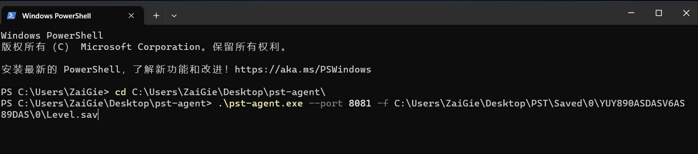

<h1 align='center'>pst-agent deployment</h1>

<p align="center">
   <a href="/README.agent.md">简体中文</a> | <strong>English</strong> | <a href="/README.agent.ja.md">日本語</a>
</p>

### Linux

This refers to the scenario where your game server is a Linux version, and you want to deploy the pst main body elsewhere. For the deployment of the pst main body, refer to the previous [Installation and Deployment](./README.md#installation-and-deployment). The impact of pst-agent is only on the modification of the configuration file.

#### Download

Download the pst-agent tool, rename it, and ensure it's executable

```bash
# Download and rename
mv pst-agent_v0.5.6_linux_x86_64 pst-agent
chmod +x pst-agent
```

#### Run

```bash
# ./pst-agent --port 8081 -f {Absolute path of the Level.sav save file}
# For example:
./pst-agent --port 8081 -f /home/lighthouse/game/Saved/0/S12ASNDDSAIF813412EERGH1EF134/Level.sav
```

After confirming it's running normally, run it in the background (it will continue to run after closing the ssh window)

```bash
# Run in the background and save logs in agent.log
nohup ./pst-agent --port 8081 -f ...{manually omitted}.../Level.sav > agent.log 2>&1 &
# View the log
tail -f agent.log
```

#### Open Firewall/Security Group

If pst-agent and pst main body are not in the same network group, you need to open the corresponding public network port of the game server (such as 8081, or other custom ports)

#### Configuration

Find the `config.yaml` file of **the pst main body (note, not the pst-agent!!!)** and modify it.

**You only need to modify `save: path`**

```yaml
...
save: # Configuration related to save file parsing
  path: "http://{Public IP of the game server}:{port}/sync" # pst-agent service interface
  ...
...
```

Restart the pst main body to apply changes

#### Close Background Operation

```bash
kill $(ps aux | grep 'pst-agent' | awk '{print $2}') | head -n 1
```

### Windows

#### Download

Download the pst-agent tool and rename it, e.g., rename `pst-agent_v0.5.6_windows_x86_64.exe` to `pst-agent.exe`

#### Run

Press `Win + R`, type `powershell` to open Powershell, use the `cd` command to navigate to the directory of the downloaded executable

```powershell
# .\pst-agent.exe --port Access Port -f Save file Level.sav location
.\pst-agent.exe --port 8081 -f C:\Users\ZaiGie\...\Level.sav
```



After successful operation, please keep the window open

#### Configuration

Find the `config.yaml` file of **the pst main body (note, not the pst-agent!!!)** and modify it.

**You only need to modify `save: path`**

```yaml
...
save: # Configuration related to save file parsing
  path: "{http://Public IP of the game server}:{port}/sync" # pst-agent service interface
  ...
...
```

Restart the pst main body to apply changes
