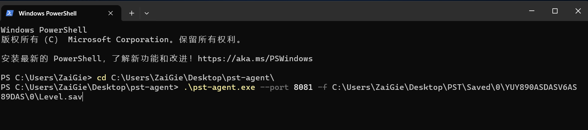

<h1 align='center'>pst-agent 配備します</h1>

<p align="center">
   <a href="/README.agent.md">简体中文</a> | <a href="/README.agent.en.md">English</a> | <strong>日本語</strong>
</p>
### Linux

これは、ゲームサーバーが Linux バージョンであり、pst 本体を他の場所にデプロイしたい場合について説明しています。デプロイには前述の[インストールとデプロイメント](./README.ja.md#インストールとデプロイメント)を参照してください。pst-agent の影響は設定ファイルの変更のみです。

#### ダウンロード

pst-agent ツールをダウンロードし、名前を変更して実行可能にします。

```bash
# ダウンロードして名前を変更
mv pst-agent_v0.5.6_linux_x86_64 pst-agent
chmod +x pst-agent
```

#### 実行

```bash
# ./pst-agent --port 8081 -f {Level.sav の絶対パス}
# 例：
./pst-agent --port 8081 -f /home/lighthouse/game/Saved/0/S12ASNDDSAIF813412EERGH1EF134/Level.sav
```

正常に動作することを確認した後、バックグラウンドで実行します（ssh ウィンドウを閉じた後も実行を続けます）。

```bash
# バックグラウンドで実行し、ログを agent.log に保存
nohup ./pst-agent --port 8081 -f ...{省略}.../Level.sav > agent.log 2>&1 &
# ログを確認
tail -f agent.log
```

#### ファイアウォール/セキュリティグループを開放

pst-agent と pst 本体が同じネットワークグループ内に完全に存在しない場合、ゲームサーバーの該当する公開ポート（例えば 8081、またはカスタマイズされた他のポートも可能）を開放する必要があります。

#### 設定

**pst 本体（pst-agent ではありません！！！）**の`config.yaml`ファイルを見つけて変更します。

**`save: path`のみ変更する必要があります**

```yaml
...
save: # セーブファイル解析関連の設定
  path: "http://ゲームサーバーの公開IP:ポート/sync" # pst-agent サービスインターフェース
  ...
...
```

pst 本体を再起動すれば完了です。

#### バックグラウンド実行を停止

```bash
kill $(ps aux | grep 'pst-agent' | awk '{print $2}') | head -n 1
```

### Windows

#### ダウンロード

pst-agent ツールをダウンロードし、名前を変更します。例えば、`pst-agent_v0.5.6_windows_x86_64.exe`を`pst-agent.exe`にリネームします。

#### 実行

`Win + R`を押し、`powershell`を入力して Powershell を開き、`cd`コマンドでダウンロードした実行ファイルのディレクトリに移動します。

```powershell
# .\pst-agent.exe --port アクセスポート -f セーブファイル Level.sav の場所
.\pst-agent.exe --port 8081 -f C:\Users\ZaiGie\...\Level.sav
```



正常に実行されたら、ウィンドウを開いたままにしてください。

#### 設定

**pst 本体（pst-agent ではありません！！！）**の`config.yaml`ファイルを見つけて変更します。

**`save: path`のみ変更する必要があります**

```yaml
...
save: # セーブファイル解析関連の設定
  path: "http://ゲームサーバーの公開IP:ポート/sync" # pst-agent サービスインターフェース
  ...
...
```

pst 本体を再起動すれば完了です。
