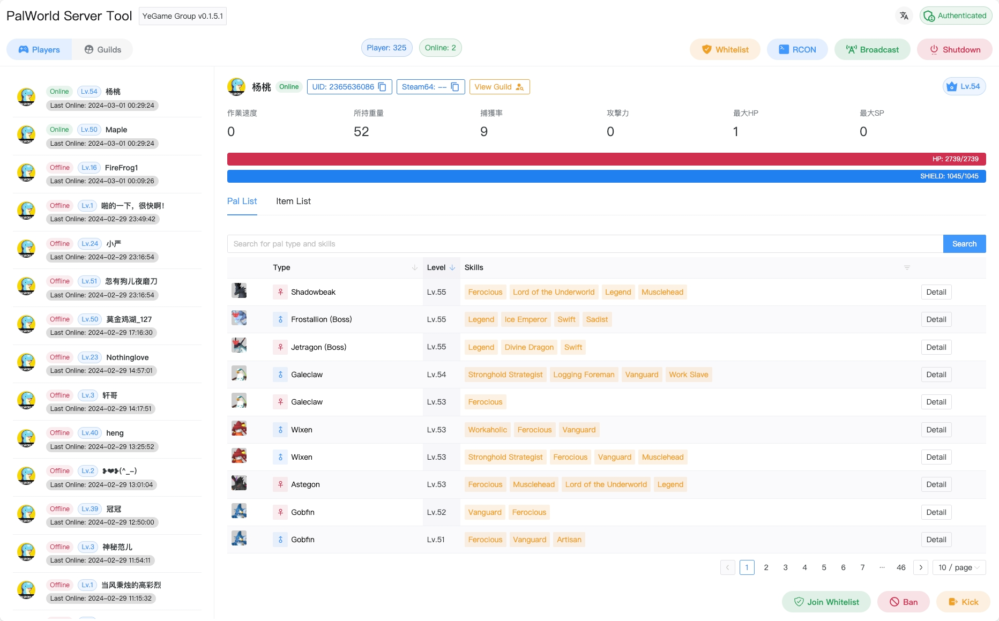
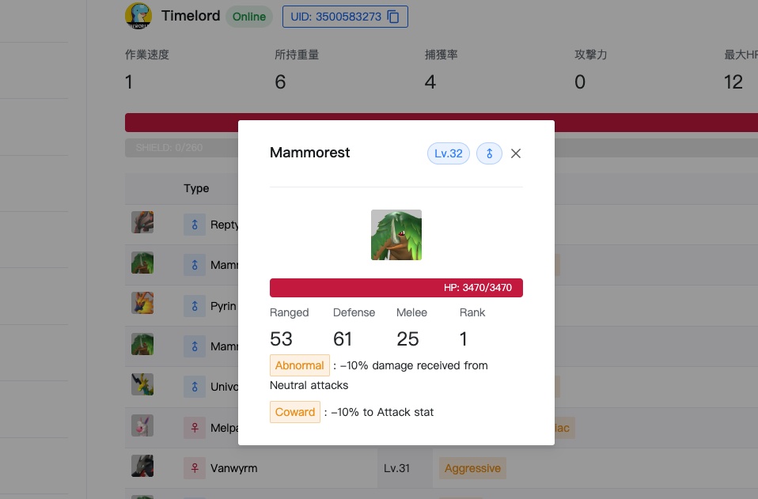
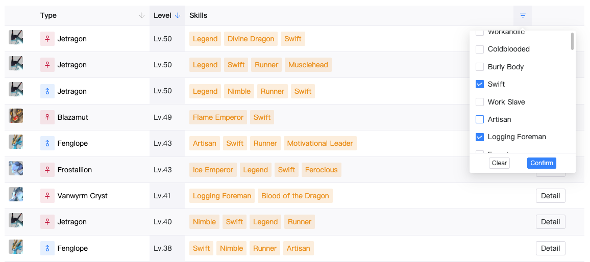
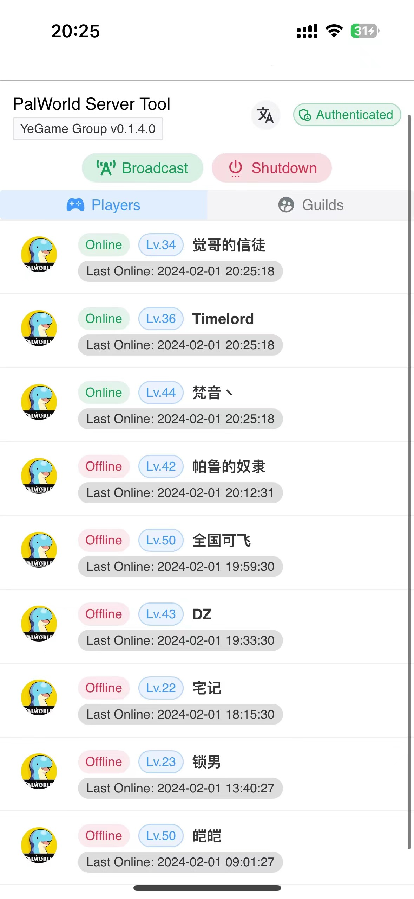
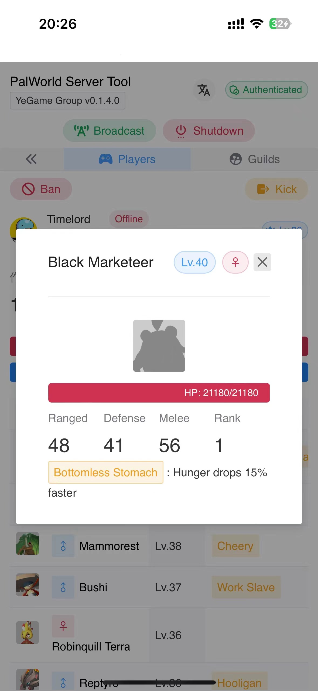
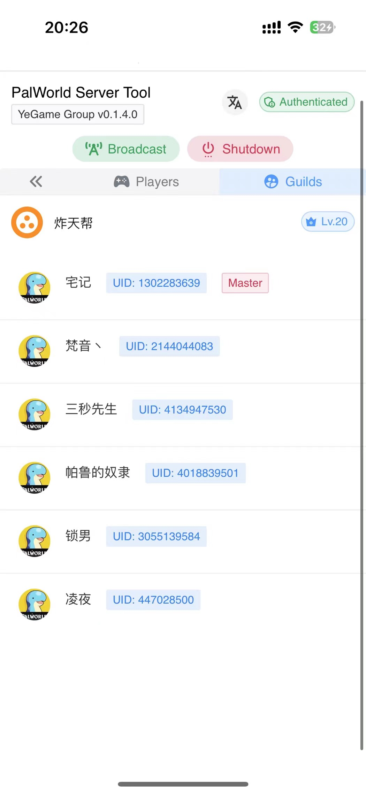
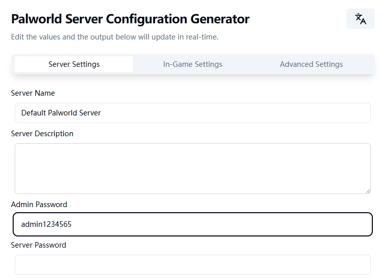

<h1 align='center'>PalWorld Server Tool</h1>

<p align="center">
   <a href="/README.md">简体中文</a> | <strong>English</strong> | <a href="/README.ja.md">日本語</a>
</p>

<p align='center'> 
  Manage your Palworld dedicated server through a visual interface and REST API, using SAV file parsing and REST&RCON functionalities.<br/>
  And it took a long and boring time to i18n...
</p>

<p align='center'>
&nbsp;&nbsp;
&nbsp;&nbsp;
&nbsp;&nbsp;

</p>



> The current mobile adaptation is good, you can view [Function Screenshot](#function-screenshot)
>
> Of course, the dark mode is also arranged no problem ~

Features based on parsing of `Level.sav` save files:

- [x] Complete player data
- [x] Player Palworld data
- [x] Guild data
- [x] Player Backpack Item data

Features implemented using official REST API:

- [x] Retrieve server information
- [x] Obtain server metrics
- [x] Online player list
- [x] Kick/ban players
- [x] In-game broadcasting
- [x] Smooth server shutdown with broadcast message

Additional features provided by the tool:

- [x] Whitelist management
- [x] Defines and executes the RCON command
- [x] Automatic archive backup and management

This tool uses bbolt for single file storage, fetching and saving data from RCON and Level.sav files via scheduled tasks. It provides a simple visual interface and REST API for easy management and development.

Due to limited maintenance and development staff, we welcome front-end, back-end developers, and even data engineers to submit PRs!

## Function screenshot

https://github.com/zaigie/palworld-server-tool/assets/17232619/49abcd34-0752-487e-8588-b6d1834f07d5

### Desktop

|                              |                              |
| :--------------------------: | :--------------------------: |
|  |  |


### Mobile

<p align="center">

</p>

## Enable REST API and RCON

In this project, the REST API function of the server must be enabled for normal use, and the custom RCON function depends on the RCON function.

If your private service tutorial is better written, if not, please close the server first, then modify the `PalWorldSettings.ini` file or `WorldOption.sav` file at [Pal-Conf](https://pal-conf.bluefissure.com/) and place it in the appropriate location to enable the server.

First set **Administrator password**



Then set **RCON** and **REST API**


## Installation and Deployment

- [File Deployment](#file-deployment)
  - [Linux](#linux)
  - [Windows](#windows)
- [Docker Depolyment](#docker-deployment)
  - [Monolithic Deployment](#monolithic-deployment)
  - [Agent Deployment](#agent-deployment)
  - [Synchronizing Archives from k8s-pod](#synchronizing-archives-from-k8s-pod)
- [Synchronizing Archives from Docker Container](#synchronizing-archives-from-docker-container)

> The task of parsing `Level.sav` requires some system memory (often 1GB-3GB) in a short period (<20s) , this portion of memory is released after the parsing task is completed. Ensure your server has enough memory.

Rimer believes that by **putting the pst tool and the game server on the same physical machine**, there are some situations where you might not want to deploy them on the same machine:

- Must be deployed separately on another server
- Only need to deploy on a local PC
- The game server performance is weak and not satisfied, using one of the above two schemes

Please refer to [pst-agent deployment tutorial](./README.agent.en.md) or [Synchronizing Archives from k8s-pod](#synchronizing-archives-from-k8s-pod)

### File Deployment

Download the latest executable files at:

- [Github Releases](https://github.com/zaigie/palworld-server-tool/releases)

#### Linux

##### Download and Extract

```bash
# Download pst_{version}_{platform}_{arch}.tar.gz and extract to the pst directory
mkdir -p pst && tar -xzf pst_v0.7.1_linux_x86_64.tar.gz -C pst
```

##### Configuration

1. Open the directory and allow execution

   ```bash
   cd pst
   chmod +x pst sav_cli
   ```

2. Find the `config.yaml` file and modify it as per the instructions.

   For `decode_path`, it's usually the pst directory plus `sav_cli`. Can be empty, the current directory will be obtained by default

   ```yaml
   # WebUI Config
   web:
     # WebUI Admin Password
     password: ""
     # WebUI Port
     port: 8080
     # Enable TLS
     tls: false
     # TLS Cert File Path if Enable TLS
     cert_path: ""
     # TLS Key File Path if Enable TLS
     key_path: ""
     # TLS url for sav_cli to communicate eg. https://yourdomain.com
     public_url: ""

   # Task Config
   task:
     # Regular intervals to get information from the game service about the player's online presence
     sync_interval: 60
     # Player entry/exit server notification
     player_logging: true
     # Player enters server message
     player_login_message: "Player {username} has joined the server! Current online player count: {online_num}."
     # Player leaving server message
     player_logout_message: "Player {username} has left the server! Current online player count: {online_num}."

   # RCON Config
   rcon:
     # RCON Address Port
     address: "127.0.0.1:25575"
     # Server AdminPassword
     password: ""
     # Use PalGuard base64 RCON
     use_base64: false
     # RCON Timeout Sec
     timeout: 5

   # REST API Config
   rest:
     # REST API address
     address: "http://127.0.0.1:8212"
     # User name of Base Auth, which is fixed to admin
     username: "admin"
     # Server AdminPassword
     password: ""
     # Request Timeout Sec
     timeout: 5

   # sav_cli Config
   save:
     # Sav File Path
     path: "/path/to/your/Pal/Saved"
     # Sav_cli Path, Could be empty
     decode_path: ""
     # Sav Decode Interval Sec
     sync_interval: 120
     # Save Backup Interval Sec
     backup_interval: 14400

   # Automation Config
   manage:
     # Auto Kick non-whitelisted
     kick_non_whitelist: false
   ```

##### Run

```bash
./pst
```

```log
2024/01/31 - 22:39:20 | INFO | palworld-server-tool/main.go:75 | Starting PalWorld Server Tool...
2024/01/31 - 22:39:20 | INFO | palworld-server-tool/main.go:76 | Version: Develop
2024/01/31 - 22:39:20 | INFO | palworld-server-tool/main.go:77 | Listening on http://127.0.0.1:8080 or http://192.168.1.66:8080
2024/01/31 - 22:39:20 | INFO | palworld-server-tool/main.go:78 | Swagger on http://127.0.0.1:8080/swagger/index.html
```

For background operation (running after SSH window is closed):

```bash
# Run in the background and save the log in server.log
nohup ./pst > server.log 2>&1 &
# To view logs
tail -f server.log
```

##### Stopping Background Process

```bash
kill $(ps aux | grep 'pst' | awk '{print $2}') | head -n 1
```

##### Access

Access via browser at http://127.0.0.1:8080 or http://{Local Network IP}:8080

Access at http://{Server IP}:8080 after opening firewall and security group in cloud servers.

> [!WARNING]
> If you open the file for the first time, nothing will be displayed. Please **wait until the first sav archive synchronization is complete**
>
> If your server configuration is sufficient and performance is good, you can try to make `save.sync_interval` shorter.

#### Windows

##### Download and Extract

Extract `pst_v0.7.1_windows_x86_64.zip` to any directory (recommend naming the folder `pst`).

##### Configuration

Find the `config.yaml` file in the extracted directory and modify it according to the instructions.

For `decode_path`, it's typically the pst directory plus `sav_cli.exe`. Can be empty, the current directory will be obtained by default

You can also right-click - "Properties", view the path and file name, and then concatenate them. (Same for archive file path and tool path)

> [!WARNING]
> Instead of pasting the copied path directly into `config.yaml`, add another '\\' in front of all '\\', as shown below
>
> It is also important to make sure that the `config.yaml` file is **ANSI encoded**, other encoding formats will cause problems such as path errors!!

```yaml
# WebUI Config
web:
  # WebUI Admin Password
  password: ""
  # WebUI Port
  port: 8080
  # Enable TLS
  tls: false
  # TLS Cert File Path if Enable TLS
  cert_path: ""
  # TLS Key File Path if Enable TLS
  key_path: ""
  # TLS url for sav_cli to communicate eg. https://yourdomain.com
  public_url: ""

# Task Config
task:
  # Regular intervals to get information from the game service about the player's online presence
  sync_interval: 60
  # Player entry/exit server notification
  player_logging: true
  # Player enters server message
  player_login_message: "Player {username} has joined the server! Current online player count: {online_num}."
  # Player leaving server message
  player_logout_message: "Player {username} has left the server! Current online player count: {online_num}."

# RCON Config
rcon:
  # RCON Address Port
  address: "127.0.0.1:25575"
  # Server AdminPassword
  password: ""
  # Use PalGuard base64 RCON
  use_base64: false
  # RCON Timeout Sec
  timeout: 5

# REST API Config
rest:
  # REST API address
  address: "http://127.0.0.1:8212"
  # User name of Base Auth, which is fixed to admin
  username: "admin"
  # Server AdminPassword
  password: ""
  # Request Timeout Sec
  timeout: 5

# sav_cli Config
save:
  # Sav File Path
  path: "C:\\path\\to\\your\\Pal\\Saved"
  # Sav_cli Path, Could be empty
  decode_path: ""
  # Sav Decode Interval Sec
  sync_interval: 120
  # Save Backup Interval Sec
  backup_interval: 14400

# Automation Config
manage:
  # Auto Kick non-whitelisted
  kick_non_whitelist: false
```

##### Running

Two ways to run on Windows:

1. start.bat (Recommended)

   Find and double-click the `start.bat` file in the extracted directory.

2. Press `Win + R`, enter `powershell` to open Powershell, navigate to the directory of the downloaded executable file using the `cd` command.

   ```powershell
   .\pst.exe
   ```

```log
2024/01/31 - 22:39:20 | INFO | palworld-server-tool/main.go:75 | Starting PalWorld Server Tool...
2024/01/31 - 22:39:20 | INFO | palworld-server-tool/main.go:76 | Version: Develop
2024/01/31 - 22:39:20 | INFO | palworld-server-tool/main.go:77 | Listening on http://127.0.0.1:8080 or http://192.168.31.214:8080
2024/01/31 - 22:39:20 | INFO | palworld-server-tool/main.go:78 | Swagger on http://127.0.0.1:8080/swagger/index.html
```

If you see the preceding interface, it indicates that the operation is successful. Keep the window open.

##### Access

Access via browser at http://127.0.0.1:8080 or http://{Local Network IP}:8080

Access at http://{Server IP}:8080 after opening firewall and security group in cloud servers.

> [!WARNING]
> If you open the file for the first time, nothing will be displayed. Please **wait until the first sav archive synchronization is complete**
>
> If your server configuration is sufficient and performance is good, you can try to make `save.sync_interval` shorter.

### Docker Deployment

#### Monolithic Deployment

Only one container is needed. Map the game's save directory to the container's internal directory, running on the same physical host as the game server.

```bash
docker run -d --name pst \
-p 8080:8080 \
-v /path/to/your/Pal/Saved:/game \
-v ./backups:/app/backups \
-e WEB__PASSWORD="your web password" \
-e RCON__ADDRESS="172.17.0.1:25575" \
-e RCON__PASSWORD="your admin password" \
-e REST__ADDRESS="http://127.0.0.1:8212" \
-e REST__PASSWORD="your admin password" \
-e SAVE__PATH="/game" \
-e SAVE__SYNC_INTERVAL=120 \
jokerwho/palworld-server-tool:latest
```

Most importantly, use `-v` to map the game's save file (Level.sav) directory to the container's `/game` directory.

##### Persistence

If you need to persist the `pst.db` file:

```bash
# Create the file first to prevent it from being recognized as a directory
touch pst.db
```

Then add `-v ./pst.db:/app/pst.db` in `docker run -v`.

##### Environment Variables

Set various environment variables, similar to those in [`config.yaml`](#configuration). The table below lists them:

> [!WARNING]
> Pay attention to the distinction between single and multiple underscores. It's best to copy the variable names from the table below for modifications!

|         Variable Name         |      Default Value      |  Type  |                                       Description                                       |
| :---------------------------: | :---------------------: | :----: | :-------------------------------------------------------------------------------------: |
|        WEB\_\_PASSWORD        |           ""            |  Text  |                          Password for Web interface admin mode                          |
|          WEB\_\_PORT          |          8080           | Number |    **Changing the container mapping port is recommended instead of modifying this**     |
|                               |                         |        |                                                                                         |
|        RCON\_\_ADDRESS        |    "127.0.0.1:25575"    |  Text  |            RCON service address, can use container network 172.17.0.1:25575             |
|       RCON\_\_PASSWORD        |           ""            |  Text  |                     AdminPassword in the server configuration file                      |
|      RCON\_\_USE_BASE64       |          false          |  Bool  |                              Whether to enable RconBase64                               |
|        RCON\_\_TIMEOUT        |            5            | Number |                      Timeout for individual RCON service requests                       |
|                               |                         |        |                                                                                         |
|     TASK\_\_SYNC_INTERVAL     |           60            | Number |                             Synchronize player online data                              |
|    TASK\_\_PLAYER_LOGGING     |          false          |  Bool  |                      Players log in/log out of broadcast messages                       |
| TASK\_\_PLAYER_LOGIN_MESSAGE  |           ""            |  Text  |                       Players log in to broadcast message content                       |
| TASK\_\_PLAYER_LOGOUT_MESSAGE |           ""            |  Text  |                    The player logs out the broadcast message content                    |
|                               |                         |        |                                                                                         |
|        REST\_\_ADDRESS        | "http://127.0.0.1:8212" |  Text  |  The address corresponding to the service REST API can be used in a container network   |
|       REST\_\_PASSWORD        |           ""            |  Text  |                        AdminPassword in the server configuration                        |
|        REST\_\_TIMEOUT        |            5            | Number |                                     Request Timeout                                     |
|                               |                         |        |                                                                                         |
|         SAVE\_\_PATH          |           ""            |  Text  |           Game save path **be sure to fill in the path inside the container**           |
|      SAVE\_\_DECODE_PATH      |     "/app/sav_cli"      |  Text  | ⚠️ Built into the container, do not modify, or it will cause save analysis tool errors  |
|     SAVE\_\_SYNC_INTERVAL     |           600           | Number |                          Interval for syncing player save data                          |
|    SAVE\_\_BACKUP_INTERVAL    |          14400          | Number |                        Interval for auto backup player save data                        |
| MANAGE\_\_KICK_NON_WHITELIST  |          false          |  Bool  | Automatically kicked out when it detects that a player is not whitelisted but is online |

#### Agent Deployment

Two containers are required: `palworld-server-tool` and `palworld-server-tool-agent`.

Applicable for:

- Separate deployment on other servers.
- Deployment only on a local personal computer.
- If the game server's performance is weak and does not meet the requirements, use one of the above two schemes.

##### First, run the agent container

```bash
docker run -d --name pst-agent \
-p 8081:8081 \
-v /path/to/your/Pal/Saved:/game \
-e SAVED_DIR="/game" \
jokerwho/palworld-server-tool-agent:latest
```

You need to `-v` to the directory where the game save file (Level.sav) is located, mapping it to the `/game` directory in the container.

| Variable Name | Default Value | Type |                              Description                               |
| :-----------: | :-----------: | :--: | :--------------------------------------------------------------------: |
|   SAVED_DIR   |      ""       | Text | Game `Saved` path **be sure to fill in the path inside the container** |

##### Then, run the pst container

```bash
docker run -d --name pst \
-p 8080:8080 \
-v ./backups:/app/backups \
-e WEB__PASSWORD="your password" \
-e RCON__ADDRESS="{GameServerIP}:{RconPort}" \
-e RCON__PASSWORD="your admin password" \
-e REST__ADDRESS="http://{GameServerIP}:{RestAPIPort}" \
-e REST__PASSWORD="your admin password" \
-e SAVE__PATH="http://{GameServerIP}:{AgentPort}/sync" \
-e SAVE__SYNC_INTERVAL=120 \
jokerwho/palworld-server-tool:latest
```

##### Persistence

If you need to persist the `pst.db` file:

```bash
# Create the file first to prevent it from being recognized as a directory
touch pst.db
```

Then add `-v ./pst.db:/app/pst.db` in `docker run -v`.

##### Environment Variables

> [!WARNING]
> Pay attention to the distinction between single and multiple underscores. It's best to copy the variable names from the table below for modifications!

|         Variable Name         |      Default Value      |  Type  |                                       Description                                       |
| :---------------------------: | :---------------------: | :----: | :-------------------------------------------------------------------------------------: |
|        WEB\_\_PASSWORD        |           ""            |  Text  |                          Password for Web interface admin mode                          |
|          WEB\_\_PORT          |          8080           | Number |    **Changing the container mapping port is recommended instead of modifying this**     |
|                               |                         |        |                                                                                         |
|        RCON\_\_ADDRESS        |    "127.0.0.1:25575"    |  Text  |            RCON service address, can use container network 172.17.0.1:25575             |
|       RCON\_\_PASSWORD        |           ""            |  Text  |                     AdminPassword in the server configuration file                      |
|      RCON\_\_USE_BASE64       |          false          |  Bool  |                              Whether to enable RconBase64                               |
|        RCON\_\_TIMEOUT        |            5            | Number |                      Timeout for individual RCON service requests                       |
|                               |                         |        |                                                                                         |
|     TASK\_\_SYNC_INTERVAL     |           60            | Number |                             Synchronize player online data                              |
|    TASK\_\_PLAYER_LOGGING     |          false          |  Bool  |                      Players log in/log out of broadcast messages                       |
| TASK\_\_PLAYER_LOGIN_MESSAGE  |           ""            |  Text  |                       Players log in to broadcast message content                       |
| TASK\_\_PLAYER_LOGOUT_MESSAGE |           ""            |  Text  |                    The player logs out the broadcast message content                    |
|                               |                         |        |                                                                                         |
|        REST\_\_ADDRESS        | "http://127.0.0.1:8212" |  Text  |  The address corresponding to the service REST API can be used in a container network   |
|       REST\_\_PASSWORD        |           ""            |  Text  |                        AdminPassword in the server configuration                        |
|        REST\_\_TIMEOUT        |            5            | Number |                                     Request Timeout                                     |
|                               |                         |        |                                                                                         |
|         SAVE\_\_PATH          |           ""            |  Text  |   pst-agent service address, format as<br> http://{Game server IP}:{Agent port}/sync    |
|      SAVE\_\_DECODE_PATH      |     "/app/sav_cli"      |  Text  | ⚠️ Built into the container, do not modify, or it will cause save analysis tool errors  |
|     SAVE\_\_SYNC_INTERVAL     |           600           | Number |                          Interval for syncing player save data                          |
|    SAVE\_\_BACKUP_INTERVAL    |          14400          | Number |                        Interval for auto backup player save data                        |
| MANAGE\_\_KICK_NON_WHITELIST  |          false          |  Bool  | Automatically kicked out when it detects that a player is not whitelisted but is online |

#### Synchronizing Archives from k8s-pod

Starting from v0.5.3, it is supported to synchronize game server archives within a cluster without the need for an agent.

> After v0.5.8, due to the addition of player backpack data viewing, the directory of the entire Sav file is copied, and you must ensure that the Palu server container has a tar tool in order to compress and decompress.

> Make sure that the serviceaccount used by pst has "pods/exec" permissions!

You only need to change the `SAVE__PATH` environment variable, in the following format:

```bash
SAVE__PATH="k8s://<namespace>/<podname>/<container>:<Game Archive Directory>"
```

For example:

```bash
SAVE__PATH="k8s://default/palworld-server-0/palworld-server:/palworld/Pal/Saved"
```

> Since the time and location (including HASH) of the Level.sav file created by the game server are uncertain at the first instance, you only need to point to the Saved directory level, and the program will automatically scan.

When pst and the game server are in the same namespace, you can omit it:

```bash
SAVE__PATH="k8s://palworld-server-0/palworld-server:/palworld/Pal/Saved"
```

### Synchronizing Archives from Docker Container

Starting from v0.5.3, it is supported to synchronize game server archives inside a container without the need for an agent.

#### File Deployment Usage

When your pst application is deployed through running a binary file, you just need to modify the `save.path` in `config.yaml`:

```yaml
save:
  path: "docker://<container_name_or_id>:<game_save_directory>"
```

For example:

```yaml
save:
  path: docker://palworld-server:/palworld/Pal/Saved
# or
save:
  path: docker://04b0a9af4288:/palworld/Pal/Saved
```

#### Docker Deployment Usage

If the pst application is deployed as a Docker single container, then you need to modify the `SAVE__PATH` environment variable and mount the Docker daemon inside the pst container.

1. Mount the daemon

In the original `docker run` command, add the line `-v /var/run/docker.sock:/var/run/docker.sock`.

2. Modify the environment variable

Change the `SAVE__PATH` environment variable as follows:

```bash
SAVE__PATH="docker://<container_name_or_id>:<game_save_directory>"
```

For example:

```bash
SAVE__PATH="docker://palworld-server:/palworld/Pal/Saved"
#or
SAVE__PATH="docker://04b0a9af4288:/palworld/Pal/Saved"
```

> [!WARNING]
> If you see an error like `Error response from daemon: client version 1.44 is too new. Maximum supported API version is 1.43` after running, it is because the Docker API version used by your current docker engine is too low. In this case, please add another environment variable:
>
> -e DOCKER_API_VERSION="1.43" (your API version)

> Since the time and location (including HASH) of the Level.sav file created by the game server are uncertain at the first instance, you only need to point to the Saved directory level, and the program will automatically scan.

## REST API Document

[APIFox Online document](https://q4ly3bfcop.apifox.cn/)

## Acknowledgements

- [palworld-save-tools](https://github.com/cheahjs/palworld-save-tools) for providing save file parsing tool implementation
- [palworld-server-toolkit](https://github.com/magicbear/palworld-server-toolkit) for providing high performance save file parsing
- [pal-conf](https://github.com/Bluefissure/pal-conf) provides the generator configuration page
- [PalEdit](https://github.com/EternalWraith/PalEdit) for providing the initial conceptualization and logic for data processing
- [gorcon](https://github.com/gorcon/rcon) for providing the basic ability to send/receive RCON requests

## LICENSE

According to the [Apache2.0 LICENSE](LICENSE) authorization, any reprints please indicate in the README and document section! Any commercial behavior must be informed!

```

```
