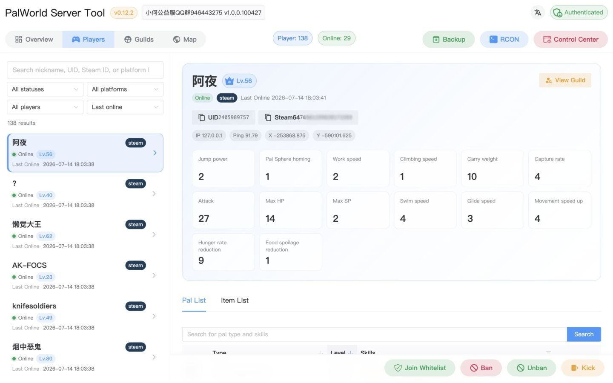
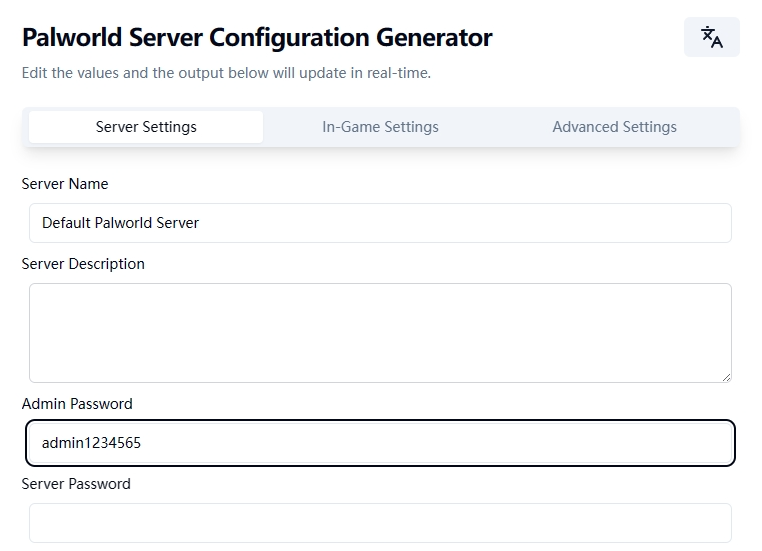
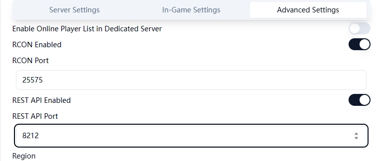

<h1 align='center'>Palworld Server Tool</h1>

<p align="center">
  <a href="/README.md">简体中文</a> | <strong>English</strong> | <a href="/README.ja.md">日本語</a>
</p>

<p align='center'>A visual dashboard and REST interface for managing a Palworld dedicated server with save parsing, the official REST API, and RCON.</p>



## Features

- Players, guilds, Pals, and inventory data
- Server information, metrics, and online players
- Kick, ban, broadcast, and graceful shutdown actions
- Interactive map and whitelist management
- Saved and scheduled RCON commands
- Scheduled save synchronization and backup management
- Responsive desktop and mobile interfaces
- Visual PST configuration in administrator mode

Application data is stored in `pst.db`. PST settings and administrator credentials are stored separately in `config.db`, so resetting settings does not remove player, guild, RCON, or backup records.

## Enable the official REST API and RCON

PST requires the Palworld server's official REST API. Custom RCON features also require RCON to be enabled. Stop the game server and use [Pal-Conf](https://pal-conf.bluefissure.com/) to configure `PalWorldSettings.ini` or `WorldOption.sav`: set the game server `AdminPassword`, then enable REST API and RCON.





## Installation

Parsing `Level.sav` briefly uses about 1–3 GB of memory.

### Release archive

1. Download the archive for your operating system and architecture from [GitHub Releases](https://github.com/zaigie/palworld-server-tool/releases).
2. On Linux/macOS, make `pst` and `sav_cli` executable and run `./pst`. On Windows, run `start.bat` or `.\pst.exe` from PowerShell.
3. Open `http://127.0.0.1:8080` or `http://server-address:8080`, create the PST dashboard administrator, and complete setup in the visual settings dialog.

The first start listens on port `8080`. Restart PST only after changing the Web listener/TLS settings or task intervals shown by the dialog.

> [!IMPORTANT]
> PST no longer reads `config.yaml`, the `-config` argument, or PST configuration environment variables. Upgrading users must copy old values into the Web settings dialog and then remove the old file and variables.

### Docker: local save directory

Create the two persistent database files first:

```bash
touch pst.db config.db
```

```bash
docker run -d --name pst \
  -p 8080:8080 \
  -v /path/to/your/Pal/Saved:/game \
  -v ./backups:/app/backups \
  -v ./pst.db:/app/pst.db \
  -v ./config.db:/app/config.db \
  jokerwho/palworld-server-tool:latest
```

In PST Settings, choose “Local directory” and select `/game`. RCON and REST addresses must be reachable from the container.

### pst-agent: remote save directory

Run `pst-agent` on the game-server host:

```bash
docker run -d --name pst-agent \
  -p 8081:8081 \
  -v /path/to/your/Pal/Saved:/game \
  -e SAVED_DIR="/game" \
  jokerwho/palworld-server-tool-agent:latest
```

Run PST without configuration environment variables. In PST Settings, choose “pst-agent” and enter `http://game-server-address:8081/sync`. See the [pst-agent guide](./README.agent.en.md) for native deployment and command-line options.

## First visit and settings

1. The first visitor creates the PST Web administrator password. This password protects the PST dashboard; it is not the Palworld server `AdminPassword`.
2. Initialization succeeds only once. If someone else completes it first, stop PST, delete `config.db`, and restart. `pst.db` is unaffected.
3. Choose either a host directory through the server-side file browser or a `pst-agent` URL.
4. Save-source and RCON groups show color-coded Not configured / Error / Normal status. RCON testing uses the official read-only `Info` command and does not mutate server state.
5. Save source, RCON, REST, messages, management settings, and password changes apply immediately. Web listener/TLS and task interval changes require a restart; the UI lists the exact fields.

The following legacy PST configuration paths are removed with no compatibility fallback:

- `config.yaml`
- the `-config` command-line argument
- `WEB__*`, `RCON__*`, `REST__*`, `SAVE__*`, `TASK__*`, and `MANAGE__*` environment variables

`pst-agent` itself still accepts its command-line directory option and `SAVED_DIR`.

## API documentation

- [APIFox documentation](https://q4ly3bfcop.apifox.cn/)
- Local Swagger: `http://127.0.0.1:8080/swagger/index.html`

## License

Licensed under the [Apache License 2.0](LICENSE).
