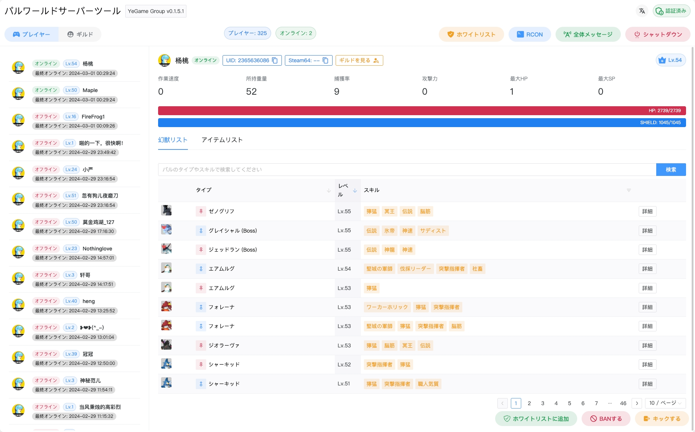
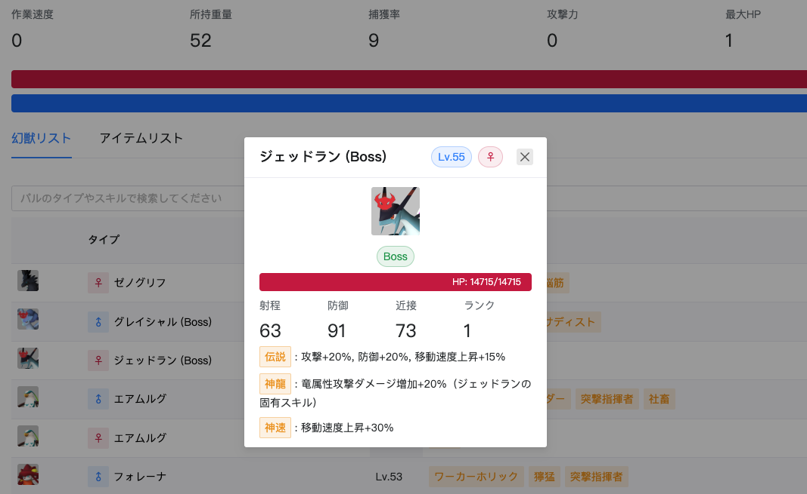
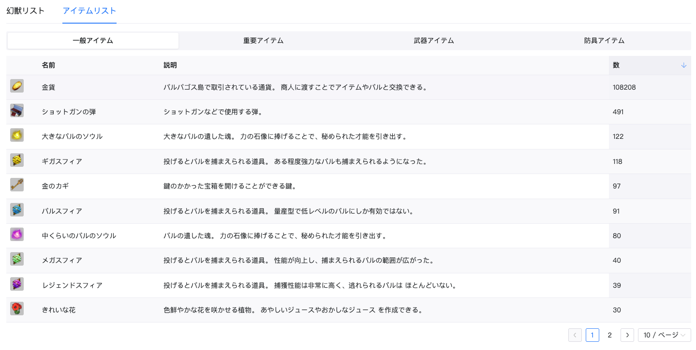
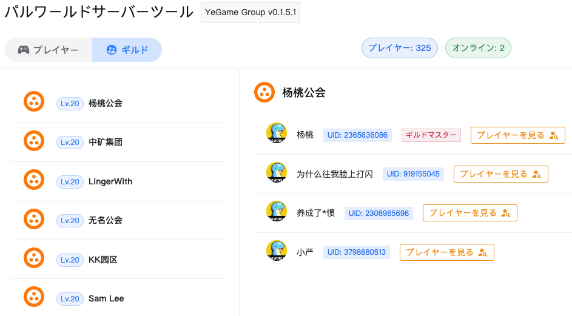
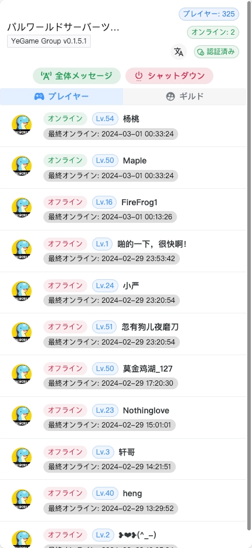
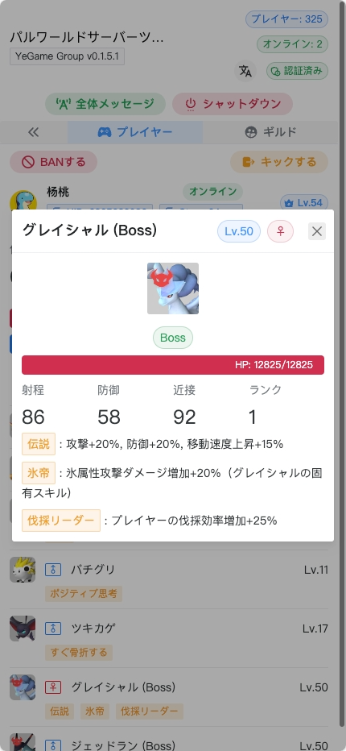
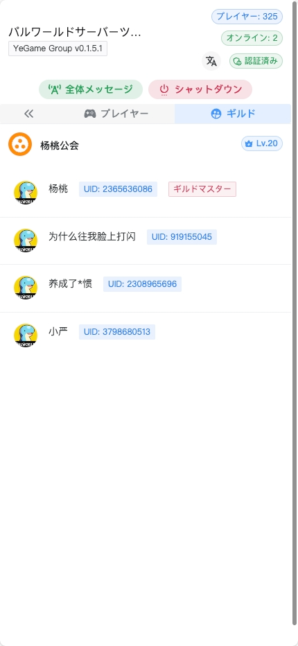
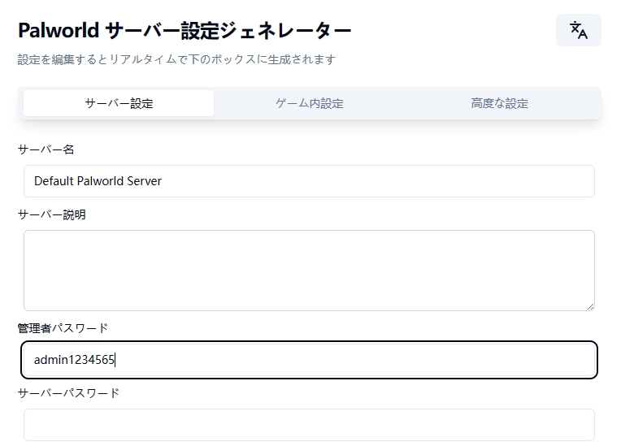
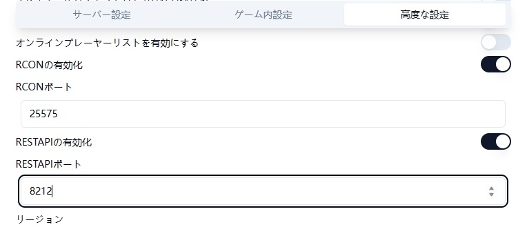

<h1 align='center'>幻獣パルサーバー管理ツール</h1>

<p align="center">
   <a href="/README.md">简体中文</a> | <a href="/README.en.md">English</a> | <strong>日本語</strong>
</p>

<p align='center'>
  可視化インターフェースとRESTインターフェースを通じて幻獣パル専用サーバーを管理し、SAVファイルの解析とREST&RCONを基にしています。<br/>
  そして、国際化のために長くて退屈な時間を費やしました...
</p>

<p align='center'>
&nbsp;&nbsp;
&nbsp;&nbsp;
&nbsp;&nbsp;

</p>



> 現在、モバイル端末にも良好に対応しており、下記の [機能スクリーンショット](#機能スクリーンショット) をご覧ください。
>
> もちろん、ダークモードもバッチリです～

`Level.sav`ファイルの解析を基にした機能：

- [x] 完全なプレイヤーデータ
- [x] プレイヤーのパルデータ
- [x] ギルドデータ
- [x] プレイヤーが荷物のデータをリュックします

公式 REST API を使って実装した機能：

- [x] サーバー情報の取得
- [x] サーバ復号メトリックを取得
- [x] オンラインプレイヤーリスト
- [x] プレイヤーのキック/バン
- [x] ゲーム内ブロードキャスト
- [x] サーバーのスムーズなシャットダウンとメッセージのブロードキャスト

ツールが追加で提供する機能：

- [x] ホワイトリスト管理
- [x] カスタム RCON コマンドの実行
- [x] アーカイブ自動バックアップと管理です

このツールは bbolt シングルファイルストレージを使用し、RCON と Level.sav ファイルのデータを定期的に取得して保存し、簡単な可視化インターフェースと REST インターフェースを提供し、管理と開発を容易にします。

メンテナンスと開発のスタッフが少ないため、意欲はありますが、力不足です。フロントエンド、バックエンド、データエンジニアの皆さんからの PR を歓迎します！

## 機能スクリーンショット

https://github.com/zaigie/palworld-server-tool/assets/17232619/afdf485c-4b34-491d-9c1f-1eb82e8060a1

### デスクトップ

|                              |                              |
| :--------------------------: | :--------------------------: |
|  |  |



### モバイル

<p align="center">

</p>

## REST API と RCON を有効にします

このプロジェクトでは、サーバーの REST API 機能を通常の使用のために有効にする必要があり、カスタム RCON 機能は RCON 関数に依存します。

マニュアルがある方が良いですが、ない場合は、最初にサービス側を閉じて、 [Pal-Conf](https://pal-conf.bluefissure.com/) `PalWorldSettings.ini` ファイルや`WorldOption.sav` ファイルをパルコンフで修正して、サービス側を有効にします。

最初に**管理者パスワード**を設定します



次に**RCON**と**REST API**を設定します



## インストールとデプロイメント

- [ファイルデプロイメント](#ファイルデプロイメント)
  - [Linux](#linux)
  - [Windows](#windows)
- [Docker デプロイメント](#docker-デプロイメント)
  - [単体デプロイメント](#単体デプロイメント)
  - [Agent デプロイメント](#agent-デプロイメント)
  - [k8s-pod からの存档同期](#k8s-pod-からの存档同期)
- [docker コンテナからの存档同期](#docker-コンテナからの存档同期)

> `Level.sav`ファイルの解析タスクは短時間（<20s）で一定量のシステムメモリ（1GB~3GB）を消費します。このメモリは解析タスク完了後に解放されるため、サーバーに十分なメモリがあることを確認してください。

ここでは、**pst ツールとゲームサーバーを同一物理マシン上に配置することをデフォルトとしています**。一部の状況では、それらを同一マシン上に配置したくない場合があります：

- 別のサーバーに単独でデプロイする必要がある
- 個人の PC にのみデプロイする必要がある
- ゲームサーバーの性能が不足しているため、上記のいずれかの方案を採用する

**[pst-agent デプロイメントガイド](./README.agent.ja.md) または [k8s-pod からの存档同期](#k8s-pod-からの存档同期) を参照してください**

### ファイルデプロイメント

以下のアドレスから最新版の実行可能ファイルをダウンロードしてください。

- [Github Releases](https://github.com/zaigie/palworld-server-tool/releases)

#### Linux

##### ダウンロードと解凍

```bash
# pst_{version}_{platform}_{arch}.tar.gz ファイルをダウンロードしてpstディレクトリに解凍します
mkdir -p pst && tar -xzf pst_v0.7.1_linux_x86_64.tar.gz -C pst
```

##### 設定

1. ディレクトリを開いて実行可能にします

   ```bash
   cd pst
   chmod +x pst sav_cli
   ```

2. `config.yaml`ファイルを見つけて、指示に従って変更します。

   `decode_path`については、通常は pst ディレクトリに`sav_cli`を追加するだけです。空にすることができ、デフォルトで現在のディレクトリを取得します。

   ```yaml
   # WebUI設定
   web:
     # WebUI管理者パスワード
     password: ""
     # WebUIアクセスポート
     port: 8080
     # HTTPS TLSアクセスを有効にするかどうか
     tls: false
     # TLS証明書のパス HTTPSを使用する場合は証明書ファイルのパスを入力してください
     cert_path: ""
     # TLSキーのパス HTTPSを使用する場合は証明書キーファイルのパスを入力してください
     key_path: ""
     # HTTPSアクセスを有効にする場合は、HTTPS証明書にバインドされたドメイン名を入力してください 例：https://yourdomain.com
     public_url: ""

   # タスク関連設定です
   task:
     # タイミングゲームサービスにプレーヤーのオンライン状況を取得する間隔、単位秒です
     sync_interval: 60
     # プレイヤーのサーバーへの入/出通知です
     player_logging: true
     # プレイヤーはサーバーメッセージにアクセスします
     player_login_message: "Player {username} has joined the server! Current online player count: {online_num}."
     # プレイヤーはサーバーメッセージから離脱します
     player_logout_message: "Player {username} has left the server! Current online player count: {online_num}."

   # RCON関連設定
   rcon:
     # RCONのアドレスとポート
     address: "127.0.0.1:25575"
     # サーバー側で設定されたRCON AdminPassword
     password: ""
     # サーバーがPalGuard機能プラグインのBase64 RCON機能を有効にしているかどうか（自分でインストールする必要があります）
     use_base64: false
     # RCON通信のタイムアウト時間、<= 5を推奨
     timeout: 5

   # REST API 関連構成です
   rest:
     # RESTのアドレスです
     address: "http://127.0.0.1:8212"
     # Base Authのユーザー名,adminに固定します
     username: "admin"
     # サーバー側で設定されたRCON AdminPassword
     password: ""
     # 通信のタイムアウト時間、<= 5を推奨
     timeout: 5

   # sav_cli Config 存档ファイル解析関連設定
   save:
     # 存档ファイルパス
     path: "/path/to/your/Pal/Saved"
     # Sav_cli Path 存档解析ツールのパス、通常はpstと同一ディレクトリ、空にすることができます
     decode_path: ""
     # Sav Decode Interval Sec 存档からデータを取得する間隔、秒単位、>= 120を推奨
     sync_interval: 120
     # Sav Backup Interval Sec アーカイブ自動バックアップ間隔です、秒単位
     backup_interval: 14400

   # Automation Config 自動化管理関連
   manage:
     # プレイヤーがホワイトリストにない場合に自動的にキックするかどうか
     kick_non_whitelist: false
   ```

##### 実行

```bash
./pst
```

```log
2024/01/31 - 22:39:20 | INFO | palworld-server-tool/main.go:75 | Starting PalWorld Server Tool...
2024/01/31 - 22:39:20 | INFO | palworld-server-tool/main.go:76 | Version: Develop
2024/01/31 - 22:39:20 | INFO | palworld-server-tool/main.go:77 | Listening on http://127.0.0.1:8080 or http://192.168.1.66:8080
2024/01/31 - 22:39:20 | INFO | palworld-server-tool/main.go:78 | Swagger on http://127.0.0.1:8080/swagger/index.html
```

SSH ウィンドウを閉じても実行を続ける場合は以下のようにします。

```bash
# バックグラウンドで実行し、ログをserver.logに保存します
nohup ./pst > server.log 2>&1 &
# ログを確認する
tail -f server.log
```

##### バックグラウンド実行を停止する

```bash
kill $(ps aux | grep 'pst' | awk '{print $2}') | head -n 1
```

##### アクセス

ブラウザを通じて http://127.0.0.1:8080 または http://{ローカルネットワーク IP}:8080 にアクセスしてください。

クラウドサーバーのファイアウォールとセキュリティグループを開放した後、http://{サーバー IP}:8080 にアクセスすることもできます。

> [!WARNING]
> 最初に開いたときには内容が表示されずに空白になる場合があります。**最初の sav ファイル同期が完了するまでお待ちください**。

> サーバーの設定が十分で、パフォーマンスが良い場合は、`save.sync_interval`を短くしてみることができます。

#### Windows

##### ダウンロードと解凍

`pst_v0.7.1_windows_x86_64.zip`を任意のディレクトリに解凍します（`pst`というディレクトリ名を推奨）。

##### 設定

解凍ディレクトリ内の`config.yaml`ファイルを見つけ、指示に従って変更します。

`decode_path`に関しては、解凍後の pst ディレクトリに`sav_cli.exe`を追加するだけです。空にすることができ、デフォルトで現在のディレクトリを取得します。

マウスの右クリックから「プロパティ」を選択し、パスとファイル名を確認してから、それらを結合してください。（存档ファイルのパスとツールのパスも同様）

> [!WARNING]
> コピーしたパスを`config.yaml`に直接貼り付けるのではなく、すべての'\\'の前にもう一つ'\\'を追加する必要があります。以下に示すように
>
> また重要なのは、`config.yaml`ファイルが**ANSI エンコーディング**であることを確認してください。他のエンコーディング形式はパスエラーなどの問題を引き起こす可能性があります！！

```yaml
# WebUI設定
web:
  # WebUI管理者パスワード
  password: ""
  # WebUIアクセスポート
  port: 8080
  # HTTPS TLSアクセスを有効にするかどうか
  tls: false
  # TLS証明書のパス HTTPSを使用する場合は証明書ファイルのパスを入力してください
  cert_path: ""
  # TLSキーのパス HTTPSを使用する場合は証明書キーファイルのパスを入力してください
  key_path: ""
  # HTTPSアクセスを有効にする場合は、HTTPS証明書にバインドされたドメイン名を入力してください 例：https://yourdomain.com
  public_url: ""

# タスク関連設定です
task:
  # タイミングゲームサービスにプレーヤーのオンライン状況を取得する間隔、単位秒です
  sync_interval: 60
  # プレイヤーのサーバーへの入/出通知です
  player_logging: true
  # プレイヤーはサーバーメッセージにアクセスします
  player_login_message: "Player {username} has joined the server! Current online player count: {online_num}."
  # プレイヤーはサーバーメッセージから離脱します
  player_logout_message: "Player {username} has left the server! Current online player count: {online_num}."

# RCON関連設定
rcon:
  # RCONのアドレスとポート
  address: "127.0.0.1:25575"
  # サーバー側で設定されたRCON AdminPassword
  password: ""
  # サーバーがPalGuard機能プラグインのBase64 RCON機能を有効にしているかどうか（自分でインストールする必要があります）
  use_base64: false
  # RCON通信のタイムアウト時間、<= 5を推奨
  timeout: 5

# REST API 関連構成です
rest:
  # RESTのアドレスです
  address: "http://127.0.0.1:8212"
  # Base Authのユーザー名,adminに固定します
  username: "admin"
  # サーバー側で設定されたRCON AdminPassword
  password: ""
  # 通信のタイムアウト時間、<= 5を推奨
  timeout: 5

# sav_cli Config 存档ファイル解析関連設定
save:
  # 存档ファイルパス
  path: "/path/to/your/Pal/Saved"
  # Sav_cli Path 存档解析ツールのパス、通常はpstと同一ディレクトリ、空にすることができます
  decode_path: ""
  # Sav Decode Interval Sec 存档からデータを取得する間隔、秒単位、>= 120を推奨
  sync_interval: 120
  # Sav Backup Interval Sec アーカイブ自動バックアップ間隔です、秒単位
  backup_interval: 14400

# Automation Config 自動化管理関連
manage:
  # プレイヤーがホワイトリストにない場合に自動的にキックするかどうか
  kick_non_whitelist: false
```

##### 実行

Windows で実行するには 2 つの

方法があります。

1. start.bat（推奨）

   解凍ディレクトリ内の`start.bat`ファイルをダブルクリックして実行します。

2. `Win + R`を押して`powershell`を入力し、Powershell を開きます。`cd`コマンドでダウンロードした実行ファイルのディレクトリに移動します。

   ```powershell
   .\pst.exe
   ```

```log
2024/01/31 - 22:39:20 | INFO | palworld-server-tool/main.go:75 | Starting PalWorld Server Tool...
2024/01/31 - 22:39:20 | INFO | palworld-server-tool/main.go:76 | Version: Develop
2024/01/31 - 22:39:20 | INFO | palworld-server-tool/main.go:77 | Listening on http://127.0.0.1:8080 or http://192.168.31.214:8080
2024/01/31 - 22:39:20 | INFO | palworld-server-tool/main.go:78 | Swagger on http://127.0.0.1:8080/swagger/index.html
```

上記の画面が表示されたら、正常に実行されています。ウィンドウを開いたままにしてください。

##### アクセス

ブラウザを通じて http://127.0.0.1:8080 または http://{ローカルネットワーク IP}:8080 にアクセスしてください。

クラウドサーバーのファイアウォールとセキュリティグループを開放した後、http://{サーバー IP}:8080 にアクセスすることもできます。

> [!WARNING]
> 最初に開いたときには内容が表示されずに空白になる場合があります。**最初の sav ファイル同期が完了するまでお待ちください**。
>
> サーバーの設定が十分で、パフォーマンスが良い場合は、`save.sync_interval`を短くしてみることができます。

### Docker デプロイメント

#### 単体デプロイメント

単一のコンテナが必要で、ゲームの存档ディレクトリをコンテナ内にマッピングし、ゲームサーバーと同じ物理マシン上で実行します。

> 注意:スワップ領域を使用すると、プログラムのパフォーマンスが低下する可能性があります。メモリが不足している場合のみ使用してください

```bash
docker run -d --name pst \
-p 8080:8080 \
-v /path/to/your/Pal/Saved:/game \
-v ./backups:/app/backups \
-e WEB__PASSWORD="your web password" \
-e RCON__ADDRESS="172.17.0.1:25575" \
-e RCON__PASSWORD="your admin password" \
-e REST__ADDRESS="http://127.0.0.1:8212" \
-e REST__PASSWORD="your admin password" \
-e SAVE__PATH="/game" \
-e SAVE__SYNC_INTERVAL=120 \
jokerwho/palworld-server-tool:latest
```

最も重要なのは、ゲームの存档ファイル（Level.sav）があるディレクトリを-v オプションでコンテナ内の/game ディレクトリにマッピングすることです。

##### 永続化

`pst.db`ファイルを永続化する必要がある場合：

```bash
# ファイルをディレクトリとして認識されないようにするために、先にファイルを作成します
touch pst.db
```

その後、`docker run -v`に`-v ./pst.db:/app/pst.db`を追加します。

##### 環境変数

各環境変

数を設定します。[`config.yaml`](#設定)と基本的に似ていますが、以下の表のようになります：

> [!WARNING]
> 単一と複数のアンダースコアを区別してください。変更が必要な場合は、下表の変数名をコピーして使用してください！

|            変数名             |      デフォルト値       |    タイプ    |                                          説明                                          |
| :---------------------------: | :---------------------: | :----------: | :------------------------------------------------------------------------------------: |
|        WEB\_\_PASSWORD        |           ""            |    文字列    |                         Web インターフェースの管理者パスワード                         |
|          WEB\_\_PORT          |          8080           |     数値     | **特に必要がない限り、変更するのではなくコンテナのマッピングポートを変更してください** |
|                               |                         |              |                                                                                        |
|        RCON\_\_ADDRESS        |    "127.0.0.1:25575"    |    文字列    |    RCON サービスのアドレス、コンテナネットワークの 172.17.0.1:25575 を使用できます     |
|       RCON\_\_PASSWORD        |           ""            |    文字列    |                          サーバー設定ファイルの AdminPassword                          |
|      RCON\_\_USE_BASE64       |          false          | ブール値です |                              RCON Base64 をオンにしますか                              |
|        RCON\_\_TIMEOUT        |            5            |     数値     |                   RCON サービスへの単一リクエストのタイムアウト時間                    |
|                               |                         |              |                                                                                        |
|     TASK\_\_SYNC_INTERVAL     |           60            |     数値     |                サーバーにプレイヤーのオンラインデータの同期を要求します                |
|    TASK\_\_PLAYER_LOGGING     |          false          | ブール値です |                      プレイヤー登録・アナウンスメッセージ掲載です                      |
| TASK\_\_PLAYER_LOGIN_MESSAGE  |           ""            |    文字列    |                     プレーヤー登録メッセージコンテンツを放送します                     |
| TASK\_\_PLAYER_LOGOUT_MESSAGE |           ""            |    文字列    |                         プレイヤーが放送メッセージを掲載します                         |
|                               |                         |              |                                                                                        |
|        REST\_\_ADDRESS        | "http://127.0.0.1:8212" |    文字列    |                         API に対応したアドレスを提供しています                         |
|       REST\_\_PASSWORD        |           ""            |    文字列    |                          サーバー設定ファイルの AdminPassword                          |
|        REST\_\_TIMEOUT        |            5            |     数値     |                               タイムアウトをお願いします                               |
|                               |                         |              |                                                                                        |
|         SAVE\_\_PATH          |           ""            |    文字列    |       ゲームの存档ファイルのパス **コンテナ内のパスとして必ず記入してください**        |
|      SAVE\_\_DECODE_PATH      |     "/app/sav_cli"      |    文字列    |              ⚠️ コンテナ内蔵、変更禁止、存档解析ツールのエラーになります               |
|     SAVE\_\_SYNC_INTERVAL     |           600           |     数値     |                          プレイヤーの存档データを同期する間隔                          |
|    SAVE\_\_BACKUP_INTERVAL    |          14400          |     数値     |                           アーカイブ自動バックアップ間隔です                           |
| MANAGE\_\_KICK_NON_WHITELIST  |          false          | ブール値です |            プレイヤーがホワイトリストにない場合に自動的にキックするかどうか            |

#### Agent デプロイメント

`palworld-server-tool`と`palworld-server-tool-agent`の 2 つのコンテナが必要です。

適用可能なシナリオ：

- 他のサーバーに単独でデプロイする必要がある
- 個人の PC にのみデプロイする必要がある
- ゲームサーバーの性能が不足しているため、上記のいずれかの方案を採用する

##### 最初に agent コンテナを実行する

> 注意:スワップ領域を使用すると、プログラムのパフォーマンスが低下する可能性があります。メモリが不足している場合のみ使用してください

```bash
docker run -d --name pst-agent \
-p 8081:8081 \
-v /path/to/your/Pal/Saved:/game \
-e SAVED_DIR="/game" \
jokerwho/palworld-server-tool-agent:latest
```

ゲームの存档ファイル（Level.sav）があるディレクトリを-v オプションでコンテナ内の/game ディレクトリにマッピングする必要があります。

|  変数名   | デフォルト値 | タイプ |                                   説明                                    |
| :-------: | :----------: | :----: | :-----------------------------------------------------------------------: |
| SAVED_DIR |      ""      | 文字列 | ゲームの存档ファイルのパス **コンテナ内のパスとして必ず記入してください** |

##### 次に pst コンテナを実行する

```bash
docker run -d --name pst \
-p 8080:8080 \
-v ./backups:/app/backups \
-e WEB__PASSWORD="your password" \
-e RCON__ADDRESS="{GameServerIP}:{RconPort}" \
-e RCON__PASSWORD="your admin password" \
-e REST__ADDRESS="http://{GameServerIP}:{RestAPIPort}" \
-e REST__PASSWORD="your admin password" \
-e SAVE__PATH="http://{GameServerIP}:{AgentPort}/sync" \
-e SAVE__SYNC_INTERVAL=120 \
jokerwho/palworld-server-tool:latest
```

##### 永続化

`pst.db`ファイルを永続化する必要がある場合：

```bash
# ファイルをディレクトリとして認識されないようにするために、先にファイルを作成します
touch pst.db
```

その後、`docker run -v`に`-v ./pst.db:/app/pst.db`を追加します。

##### 環境変数

> [!WARNING]
> 単一と複数のアンダースコアを区別してください。変更が必要な場合は、下表の変数名をコピーして使用してください！

|            変数名             |      デフォルト値       |    タイプ    |                                             説明                                              |
| :---------------------------: | :---------------------: | :----------: | :-------------------------------------------------------------------------------------------: |
|        WEB\_\_PASSWORD        |           ""            |    文字列    |                            Web インターフェースの管理者パスワード                             |
|          WEB\_\_PORT          |          8080           |     数値     |    **特に必要がない限り、変更するのではなくコンテナのマッピングポートを変更してください**     |
|                               |                         |              |                                                                                               |
|        RCON\_\_ADDRESS        |    "127.0.0.1:25575"    |    文字列    |        RCON サービスのアドレス、コンテナネットワークの 172.17.0.1:25575 を使用できます        |
|       RCON\_\_PASSWORD        |           ""            |    文字列    |                             サーバー設定ファイルの AdminPassword                              |
|      RCON\_\_USE_BASE64       |          false          | ブール値です |                                 RCON Base64 をオンにしますか                                  |
|        RCON\_\_TIMEOUT        |            5            |     数値     |                       RCON サービスへの単一リクエストのタイムアウト時間                       |
|                               |                         |              |                                                                                               |
|     TASK\_\_SYNC_INTERVAL     |           60            |     数値     |                   サーバーにプレイヤーのオンラインデータの同期を要求します                    |
|    TASK\_\_PLAYER_LOGGING     |          false          | ブール値です |                         プレイヤー登録・アナウンスメッセージ掲載です                          |
| TASK\_\_PLAYER_LOGIN_MESSAGE  |           ""            |    文字列    |                        プレーヤー登録メッセージコンテンツを放送します                         |
| TASK\_\_PLAYER_LOGOUT_MESSAGE |           ""            |    文字列    |                            プレイヤーが放送メッセージを掲載します                             |
|                               |                         |              |                                                                                               |
|        REST\_\_ADDRESS        | "http://127.0.0.1:8212" |    文字列    |                            API に対応したアドレスを提供しています                             |
|       REST\_\_PASSWORD        |           ""            |    文字列    |                             サーバー設定ファイルの AdminPassword                              |
|        REST\_\_TIMEOUT        |            5            |     数値     |                                  タイムアウトをお願いします                                   |
|                               |                         |              |                                                                                               |
|         SAVE\_\_PATH          |           ""            |    文字列    | pst-agent があるサービスのアドレス、形式は<br> http://{ゲームサーバー IP}:{Agent ポート}/sync |
|      SAVE\_\_DECODE_PATH      |     "/app/sav_cli"      |    文字列    |                  ⚠️ コンテナ内蔵、変更禁止、存档解析ツールのエラーになります                  |
|     SAVE\_\_SYNC_INTERVAL     |           600           |     数値     |                             プレイヤーの存档データを同期する間隔                              |
|    SAVE\_\_BACKUP_INTERVAL    |          14400          |     数値     |                              アーカイブ自動バックアップ間隔です                               |
| MANAGE\_\_KICK_NON_WHITELIST  |          false          | ブール値です |               プレイヤーがホワイトリストにない場合に自動的にキックするかどうか                |

#### k8s-pod からの存档同期

v0.5.3 から、agent なしでクラスタ内のゲームサーバーの存档を同期することがサポートされています。

> v0.5.8 の後で、プレーヤーのバックパックのデータを増加して見るため、復制するのは全体 Sav ファイルのディレクトリで、パルのサービスの端の容器の中に tar 工具があることを確保しなければ圧縮して伸張します

> pst が使用する serviceaccount には"pods/exec"権限が必要

です！

`SAVE__PATH`環境変数を変更するだけでよく、形式は以下の通りです：

```bash
SAVE__PATH="k8s://<namespace>/<podname>/<container>:<ゲームの存档ディレクトリ>"
```

例えば：

```bash
SAVE__PATH="k8s://default/palworld-server-0/palworld-server:/palworld/Pal/Saved"
```

> ゲームサーバーが Level.sav ファイルを作成する時間と位置（HASH を含む）は初回には不確定なため、Saved ディレクトリレベルを指定してください。プログラムが自動的にスキャンします

pst とゲームサーバーが同一の namespace にある場合、namespace を省略できます：

```bash
SAVE__PATH="k8s://palworld-server-0/palworld-server:/palworld/Pal/Saved"
```

### docker コンテナからの存档同期

v0.5.3 から、agent なしでコンテナ内のゲームサーバーの存档を同期することがサポートされています。

#### ファイルデプロイメント使用時

pst 本体がバイナリファイルとしてデプロイされている場合、`config.yaml`内の`save.path`を変更するだけです：

```yaml
save:
  path: "docker://<container_name_or_id>:<ゲームの存档ディレクトリ>"
```

例えば：

```yaml
save:
  path: docker://palworld-server:/palworld/Pal/Saved
# または
save:
  path: docker://04b0a9af4288:/palworld/Pal/Saved
```

#### Docker デプロイメント使用時

pst 本体が Docker 単体デプロイメントである場合、`SAVE__PATH`環境変数を変更し、Docker デーモンを pst コンテナ内にマウントする必要があります

1. デーモンをマウントする

元の`docker run`コマンドに`-v /var/run/docker.sock:/var/run/docker.sock`を追加します

2. 環境変数を変更する

`SAVE__PATH`環境変数を以下の形式で変更します：

```bash
SAVE__PATH="docker://<container_name_or_id>:<ゲームの存档ディレクトリ>"
```

例えば：

```bash
SAVE__PATH="docker://palworld-server:/palworld/Pal/Saved"
# または
SAVE__PATH="docker://04b0a9af4288:/palworld/Pal/Saved"
```

> [!WARNING]
> 実行後に` Error response from daemon: client version 1.44 is too new. Maximum supported API version is 1.43`のようなエラーが表示された場合は、現在の docker engine が使用している Docker API のバージョンが低いことを意味します。その場合は、別の環境変数を追加してください：
>
> -e DOCKER_API_VERSION="1.43" (あなたの API バージョン)

> ゲームサーバーが Level.sav ファイルを作成する時間と位置（HASH を含む）は初回には不確定なため、Saved ディレクトリレベルを指定してください。プログラムが自動的にスキャンします

## API ドキュメント

[APIFox オンライン API ドキュメント](https://q4ly3bfcop.apifox.cn/)

## 謝辞

- [palworld-save-tools](https://github.com/cheahjs/palworld-save-tools) は存档解析ツールの実装を提供しました
- [palworld-server-toolkit](https://github.com/magicbear/palworld-server-toolkit) は存档の高性能解析の一部を提供しました
- [pal-conf](https://github.com/Bluefissure/pal-conf) 構成生成器ページを提供します
- [PalEdit](https://github.com/EternalWraith/PalEdit) は最初のデータ化思考とロジックを提供しました
- [gorcon](https://github.com/gorcon/rcon) は RCON リクエスト/レシーブの基本能力を提供しました

## ライセンス

[Apache2.0 ライセンス](LICENSE) に基づいて授与されます。任意の転載は README とファイル部分で明記してください！商用行為は必ず通知してください！
