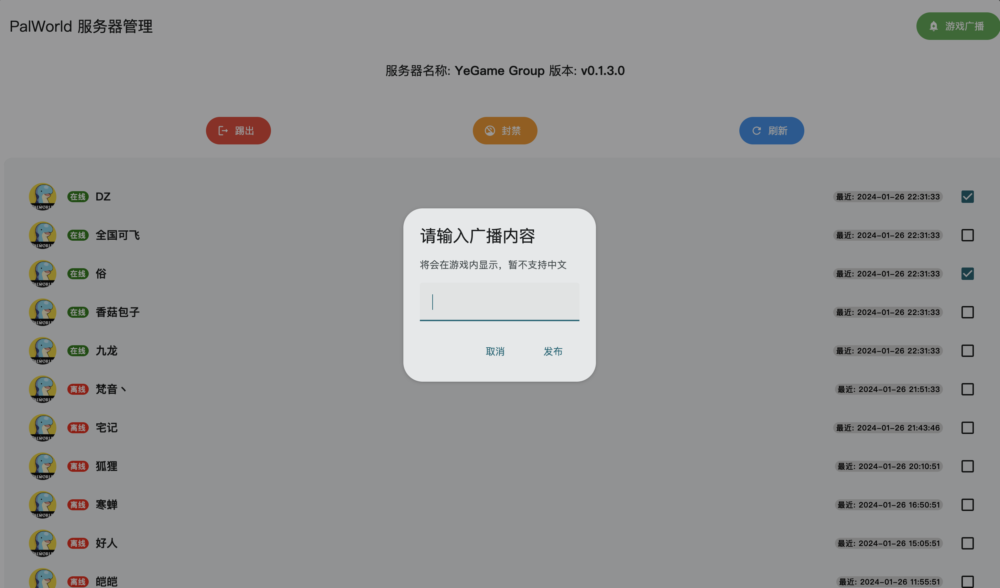
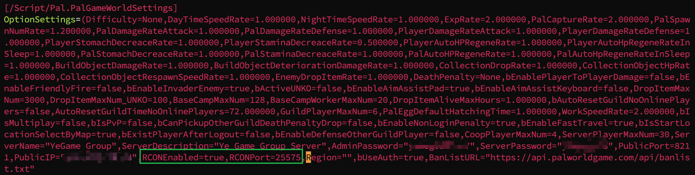
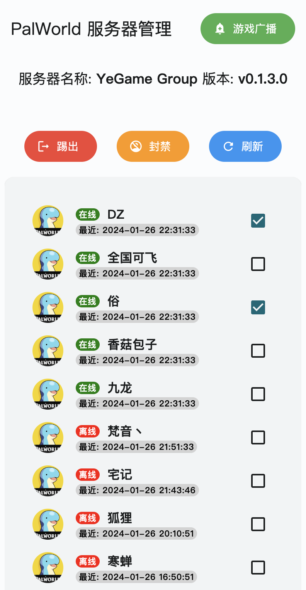

# palworld-server-tool

通过 可视化界面及 REST 接口或命令行工具管理幻兽帕鲁 / PalWorld 专用服务器，基于 RCON 实现



基于官方提供的 RCON 命令（仅服务器可用的）实现功能如下：

- [x] 获取服务器信息
- [x] 玩家列表（历史玩家数据仅 pst-server）
- [x] 踢出/封禁玩家
- [x] 游戏内广播
- [x] 平滑关闭服务器并广播消息

请在 [Releases](https://github.com/zaigie/palworld-server-tool/releases) 下载可执行文件

## 如何开启私服 RCON

需要开启服务器的 RCON 功能，如果你的私服教程有写更好，没有的话，修改 `PalWorldSettings.ini` 文件

**也就是修改游戏内各种倍数、概率的那个文件**，里面最后的位置有如下：

```txt
RCONEnabled=true,RCONPort=25575
```



请先关闭服务器，然后将 `RCONEnabled` 和 `RCONPort` 填写如上，再重启服务器即可

## pst-server: 可视化工具



服务使用 sqlite 数据库，用来存历史玩家数据，并且每五分钟会定时查询一次在线玩家列表，更新最后在线时间。

### Linux

1. 下载文件并重命名

```bash
# 下载 pst-server_{version}_{platform}_{arch} 文件并重命名
mv pst-server_v0.2.0_linux_amd64 pst-server
```

2. **首次运行**，生成 `config.yaml` 和 `players.db` 文件

```bash
./pst-server
```

**然后 Ctrl + C 关闭程序**

3. 修改 `config.yaml` 文件配置

> host 为服务器的 IP:RCON 端口

```yaml
host: 127.0.0.1:25575
password: { 这里写你的AdminPassword }
timeout: 10
```

4. 后台运行

```bash
# 后台运行并将日志保存在 server.log
nohup ./pst-server --port 8080 > server.log 2>&1 &
# 查看日志
tail -f server.log
```

5. 关闭后台程序

```bash
# 关闭程序
kill $(ps aux | grep 'pst-server' | awk '{print $2}') | head -n 1
```

**浏览器访问 http://<服务器 IP>:8080 即可打开可视化界面**

### Windows

1. 下载文件并重命名

将 pst-server_v0.2.0_windows_x86.exe 重命名为 pst-server.exe

2. 按下 `Win + R`，输入 `powershell` 打开 Powershell，通过 `cd` 命令到下载的可执行文件目录

3. **首次运行**，生成 `config.yaml` 和 `players.db` 文件

```powershell
.\pst-server.exe
```

**然后 Ctrl +C 关闭程序**

4. 记事本或编辑工具打开 `config.yaml` 文件，进行配置

> host 为服务器的 IP:RCON 端口

```yaml
host: 127.0.0.1:25575
password: { 这里写你的AdminPassword }
timeout: 10
```

5. 持续运行

```powershell
.\pst-server.exe --port 8080
```

**浏览器访问 http://<服务器 IP>:8080 即可打开可视化界面**

> [!WARNING]
> 如果玩家昵称中包含中文，则查询在线玩家列表会请求到超时时间 10s，且最后一名玩家信息可能显示不全，不全的信息没有实际意义，将会按空字符串处理且不入库

若要自己开发前端界面或用作它用请移步 [接口文档](./API.md)

---

## pst-cli: 命令行工具

```bash
# 下载 pst-cli_{version}_{platform}_{arch} 文件并重命名
mv pst-cli_{version}_{platform}_{arch} pst-cli
```

### 玩家

#### 在线玩家列表

```bash
./pst-cli player list
```

```
+-------------------------------------------+
| Pal World 在线玩家列表                    |
+----------+------------+-------------------+
| 昵称     | PLAYERUID  | STEAMID           |
+----------+------------+-------------------+
| 香菇包子 | 2398722357 | xxxxx |
| 梵音丶   | 2144044083 | xxxxx |
| 狐狸     | 1333009711 | xxxxx |
| Baoz     | <null/err> | <null/err>        |
+----------+------------+-------------------+
|          | 在线人数   | 4                 |
+----------+------------+-------------------+
```

> <null/err> 是帕鲁服务器的错误，待官方修复

#### 踢出/封禁玩家

```bash
./pst-cli kick -s <SteamID>
./pst-cli ban -s <SteamID>
```

### 广播

```bash
./pst-cli broadcast -m "<message>"
```

> [!WARNING]
> message 中不能包含中文

### 服务器

#### 关闭服务器

```bash
./pst-cli server shutdown -s <seconds> -m "Server Will Shutdown"
```
