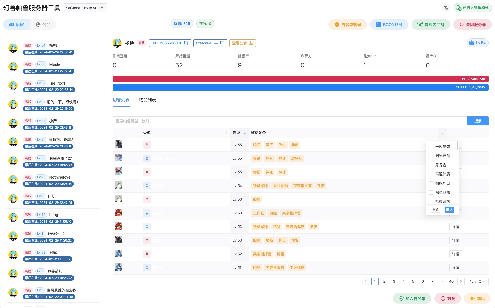
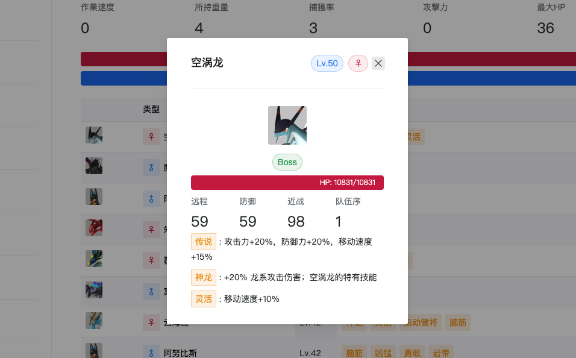
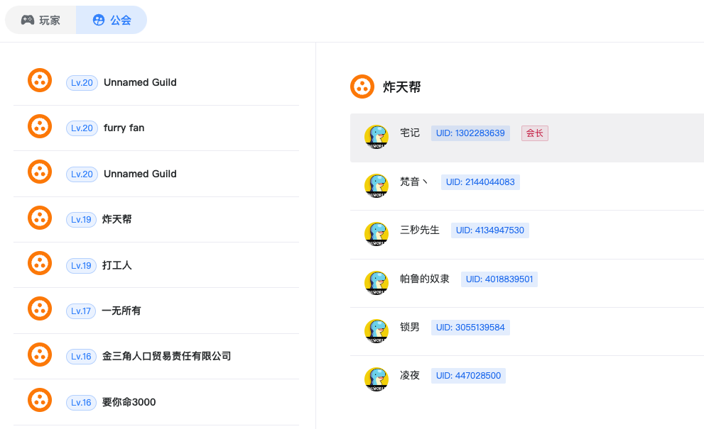
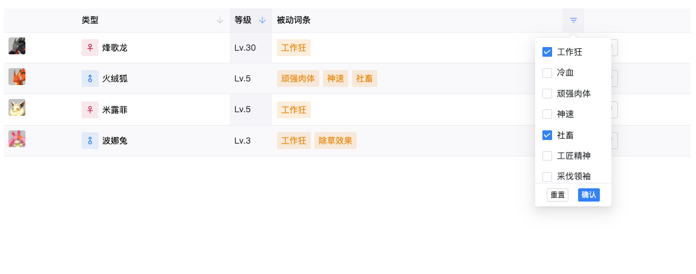
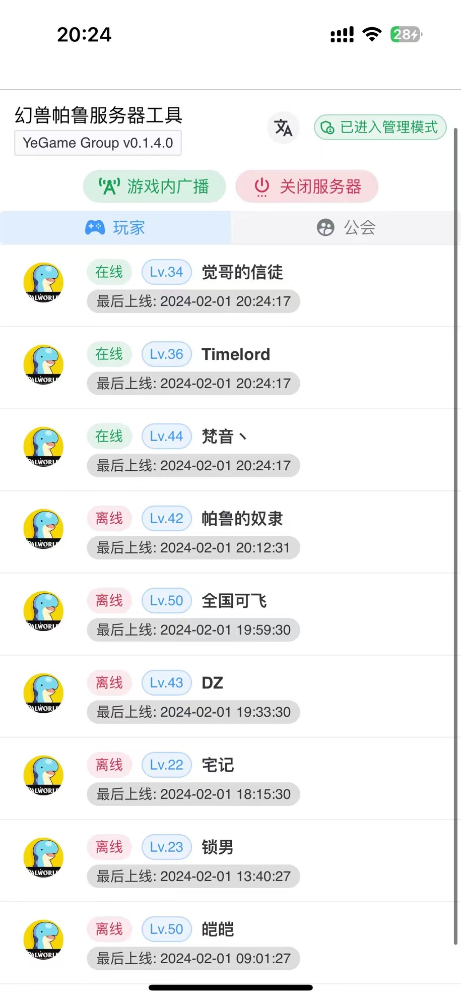
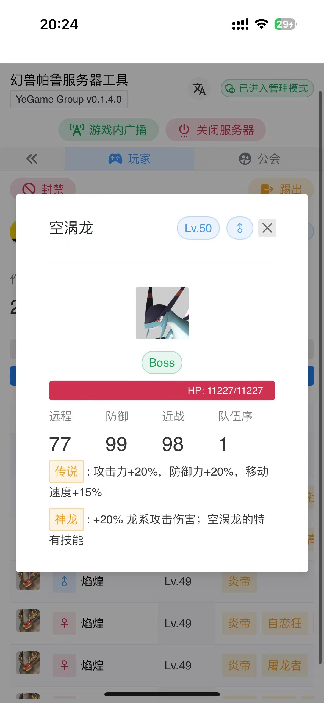
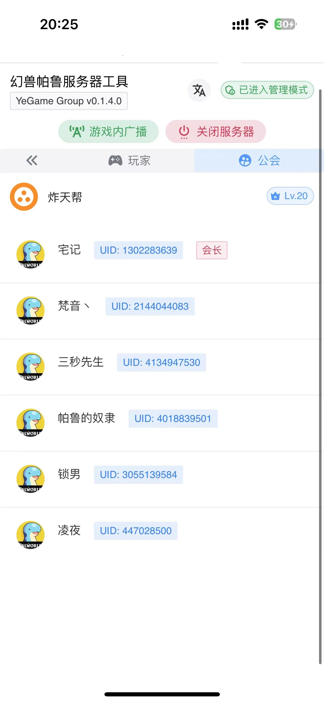
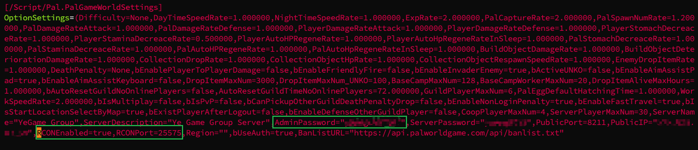
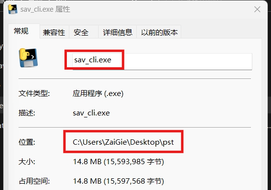

<h1 align='center'>幻兽帕鲁服务器管理工具</h1>

<p align="center">
   <strong>简体中文</strong> | <a href="/README.en.md">English</a> | <a href="/README.ja.md">日本語</a>
</p>

<p align='center'>
  通过可视化界面及 REST 接口管理幻兽帕鲁专用服务器，基于 SAV 存档文件解析及 RCON 实现<br/>
  并且花了很漫长且枯燥的时间去做了国际化...
</p>

<p align='center'>
&nbsp;&nbsp;
&nbsp;&nbsp;
&nbsp;&nbsp;

</p>



> 目前移动端适配良好，可查看下面 [功能截图](#功能截图)
>
> 当然深色模式也安排得妥妥的～

基于 `Level.sav` 存档文件解析实现的功能：

- [x] 完整玩家数据
- [x] 玩家帕鲁数据
- [x] 公会数据

基于官方提供的 RCON 命令（仅服务器可用的）实现功能：

- [x] 获取服务器信息
- [x] 在线玩家列表
- [x] 踢出/封禁玩家
- [x] 游戏内广播
- [x] 平滑关闭服务器并广播消息

工具额外提供的功能：

- [x] 白名单管理
- [x] 自定义 RCON 命令并执行

本工具使用 bbolt 单文件存储，将 RCON 和 Level.sav 文件的数据通过定时任务获取并保存，提供简单的可视化界面和 REST 接口和便于管理与开发。

由于维护开发人员较少，虽有心但力不足，欢迎各前端和后端甚至数据工程师来提交 PR！

> [!NOTE]
> 如果您需要幻兽帕鲁服务器&工具搭建交流，或者**需要闭源付费定制功能开发**，如：多服务器管理、服务器注入反作弊、可视化修改存档等，请加群或 QQ 交流

幻兽帕鲁服务器管理交流：<a target="_blank" href="https://qm.qq.com/cgi-bin/qm/qr?k=RkItz42aIvppN716Tdlpni_gSpnYasxF&jump_from=webapi&authKey=PLbIHENUObGLnW4s5476OnenRVcUNBV79g9zd0CEi5kpddfdooAsoU/SeoEdfGWq"></a>


## 功能截图

https://github.com/zaigie/palworld-server-tool/assets/17232619/7a861091-94ee-4efe-8274-15df261d50b4

### 桌面端

|                              |                              |
| :--------------------------: | :--------------------------: |
|  |  |



### 移动端

<p align="center">

</p>

## 如何开启私服 RCON

> [!CAUTION]
> 游戏服务器 v0.1.5.0 版本中，PalWorldSettings.ini 中的 RCONPort 和 RCONEnable **不生效**
>
> 请在 `./PalServer.sh` (Linux) 或 `PalServer.exe` (Windows) 后添加 -RCONPort=25575 来开启

需要开启服务器的 RCON 功能，如果你的私服教程有写更好，没有的话，修改 `PalWorldSettings.ini` 文件

**也就是修改游戏内各种倍数、概率的那个文件**，里面最后的位置有如下：

```txt
AdminPassword=...,...,RCONEnabled=true,RCONPort=25575
```



请**先关闭服务器再作修改**，你需要设置一个 AdminPassword，然后将 `RCONEnabled` 和 `RCONPort` 填写如上，再重启服务器即可。

## 安装部署

- [Sealos 一键部署](#sealos-一键部署)
- [文件部署](#文件部署)
  - [Linux](#linux)
  - [Windows](#windows)
- [Docker 部署](#docker-部署)
  - [单体部署](#单体部署)
  - [Agent 部署](#agent-部署)
  - [从 k8s-pod 同步存档](#从-k8s-pod-同步存档)
- [从 docker 容器同步存档](#从-docker-容器同步存档)

请确保前提 [开启私服 RCON](#如何开启私服-rcon)

> 解析 `Level.sav` 存档的任务需要在短时间（<20s）耗费一定的系统内存（1GB~3GB），这部分内存会在执行完解析任务后释放，因此你至少需要确保你的服务器有充足的内存。

这里**默认为将 pst 工具和游戏服务器放在同一台物理机上**，在一些情况下你可能不想要它们部署在同一机器上：

- 需要单独部署在其它服务器
- 只需要部署在本地个人电脑
- 游戏服务器性能较弱不满足，采用上述两种方案之一

**请参考 [pst-agent 部署教程](./README.agent.md) 或 [从 k8s-pod 同步存档](#从-k8s-pod-同步存档)**

### Sealos 一键部署

**30s 部署私服 + 管理工具，拒绝复杂步骤**

首先点击以下按钮一键部署帕鲁私服：

[](https://hzh.sealos.run/?uid=1b856tuu)

然后点击以下按钮一键部署 palworld-server-tool：

[](https://hzh.sealos.run/?openapp=system-template%3FtemplateName%3Dpalworld-management)

### 文件部署

请在以下地址下载最新版可执行文件

- [Github Releases](https://github.com/zaigie/palworld-server-tool/releases)

#### Linux

##### 下载解压

```bash
# 下载 pst_{version}_{platform}_{arch}.tar.gz 文件并解压到 pst 目录
mkdir -p pst && tar -xzf pst_v0.5.7_linux_x86_64.tar.gz -C pst
```

##### 配置

1. 打开目录并允许可执行

   ```bash
   cd pst
   chmod +x pst sav_cli
   ```

2. 找到其中的 `config.yaml` 文件并按照说明修改。

   关于其中的 `decode_path`，一般就是解压后的 pst 目录加上 `sav_cli` ，如果不知道绝对路径，在终端执行 `pwd` 即可

   ```yaml
   # WebUI 设置
   web:
     # WebUI 管理员密码
     password: ""
     # WebUI 访问端口
     port: 8080
     # 是否开启使用 HTTPS TLS 访问
     tls: false
     # TLS Cert 如果开启使用 HTTPS 请输入证书文件路径
     cert_path: ""
     # TLS Key 如果开启使用 HTTPS 请输入证书密钥文件路径
     key_path: ""
     # 若开启 HTTPS 访问请填写你的 HTTPS 证书绑定的域名 eg. https://yourdomain.com
     public_url: ""

   # RCON 相关设置
   rcon:
     # RCON 的地址和端口
     address: "127.0.0.1:25575"
     # 服务 端设置的 RCON AdminPassword
     password: ""
     # RCON 通信超时时间，推荐 <= 5
     timeout: 5
     # 定时向 RCON 服务获取玩家在线情况的间隔，单位秒
     sync_interval: 60

   # sav_cli Config 存档文件解析相关配置
   save:
     # 存档文件路径
     path: "/path/to/your/Pal/Saved"
     # Sav_cli Path 存档解析工具路径，一般和 pst 在同一目录
     decode_path: "/path/to/your/sav_cli"
     # Sav Decode Interval Sec 定时从存档获取数据的间隔，单位秒，推荐 >= 120
     sync_interval: 120

   # Automation Config 自动化管理相关
   manage:
     # 玩家不在白名单是否自动踢出
     kick_non_whitelist: false
   ```

##### 运行

```bash
./pst
```

```log
2024/01/31 - 22:39:20 | INFO | palworld-server-tool/main.go:75 | Starting PalWorld Server Tool...
2024/01/31 - 22:39:20 | INFO | palworld-server-tool/main.go:76 | Version: Develop
2024/01/31 - 22:39:20 | INFO | palworld-server-tool/main.go:77 | Listening on http://127.0.0.1:8080 or http://192.168.1.66:8080
2024/01/31 - 22:39:20 | INFO | palworld-server-tool/main.go:78 | Swagger on http://127.0.0.1:8080/swagger/index.html
```

若需要后台运行（关闭 ssh 窗口后仍运行）

```bash
# 后台运行并将日志保存在 server.log
nohup ./pst > server.log 2>&1 &
# 查看日志
tail -f server.log
```

##### 关闭后台运行

```bash
kill $(ps aux | grep 'pst' | awk '{print $2}') | head -n 1
```

##### 访问

请通过浏览器访问 http://127.0.0.1:8080 或 http://{局域网 IP}:8080

云服务器开放防火墙及安全组后也可以访问 http://{服务器 IP}:8080

> [!WARNING]
> 初次打开会显示空白没有内容，请**等待第一次 sav 存档同步完成**再访问
>
> 如果你的服务器配置足够且性能良好，你可以试着将 `save.sync_interval` 改短一点

#### Windows

##### 下载解压

解压 `pst_v0.5.7_windows_x86_64.zip` 到任意目录（推荐命名文件夹目录名称为 `pst`）

##### 配置

找到解压目录中的 `config.yaml` 文件并按照说明修改。

关于其中的 `decode_path`，一般就是解压后的 pst 目录加上 `sav_cli.exe`

你也可以直接鼠标右键——“属性”，查看路径和文件名，再将它们拼接起来。（存档文件路径和工具路径同理）



> [!WARNING]
> 请不要直接将复制的路径粘贴到 `config.yaml` 中，而是需要在所有的 '\\' 前面再加一个 '\\'，像下面展示的一样
>
> 还有比较重要的是，请确保 `config.yaml` 文件为 **ANSI 编码**，其它编码格式将会导致路径错误等问题！！

```yaml
# WebUI 设置
web:
  # WebUI 管理员密码
  password: ""
  # WebUI 访问端口
  port: 8080
  # 是否开启使用 HTTPS TLS 访问
  tls: false
  # TLS Cert 如果开启使用 HTTPS 请输入证书文件路径
  cert_path: ""
  # TLS Key 如果开启使用 HTTPS 请输入证书密钥文件路径
  key_path: ""
  # 若开启 HTTPS 访问请填写你的 HTTPS 证书绑定的域名 eg. https://yourdomain.com
  public_url: ""

# RCON 相关设置
rcon:
  # RCON 的地址和端口
  address: "127.0.0.1:25575"
  # 服务 端设置的 RCON AdminPassword
  password: ""
  # RCON 通信超时时间，推荐 <= 5
  timeout: 5
  # 定时向 RCON 服务获取玩家在线情况的间隔，单位秒
  sync_interval: 60

# sav_cli Config 存档文件解析相关配置
save:
  # 存档文件路径
  path: "C:\\path\\to\\your\\Pal\\Saved"
  # Sav_cli Path 存档解析工具路径，一般和 pst 在同一目录
  decode_path: "C:\\path\\to\\your\\sav_cli.exe"
  # Sav Decode Interval Sec 定时从存档获取数据的间隔，单位秒，推荐 >= 120
  sync_interval: 120

# Automation Config 自动化管理相关
manage:
  # 玩家不在白名单是否自动踢出
  kick_non_whitelist: false
```

##### 运行

这里有两种方式可以在 Windows 下运行

1. start.bat（推荐）

   找到解压目录下的 `start.bat` 文件，双击运行

2. 按下 `Win + R`，输入 `powershell` 打开 Powershell，通过 `cd` 命令到下载的可执行文件目录

   ```powershell
   .\pst.exe
   ```

```log
2024/01/31 - 22:39:20 | INFO | palworld-server-tool/main.go:75 | Starting PalWorld Server Tool...
2024/01/31 - 22:39:20 | INFO | palworld-server-tool/main.go:76 | Version: Develop
2024/01/31 - 22:39:20 | INFO | palworld-server-tool/main.go:77 | Listening on http://127.0.0.1:8080 or http://192.168.31.214:8080
2024/01/31 - 22:39:20 | INFO | palworld-server-tool/main.go:78 | Swagger on http://127.0.0.1:8080/swagger/index.html
```

看到上述界面表示成功运行，请保持窗口打开

##### 访问

请通过浏览器访问 http://127.0.0.1:8080 或 http://{局域网 IP}:8080

云服务器开放防火墙及安全组后也可以访问 http://{服务器 IP}:8080

> [!WARNING]
> 初次打开会显示空白没有内容，请**等待第一次 sav 存档同步完成**再访问
>
> 如果你的服务器配置足够且性能良好，你可以试着将 `save.sync_interval` 改短一点

### Docker 部署

#### 单体部署

只需要一个容器，将游戏存档目录映射至容器内，与游戏服务器在同一物理主机上运行。

> 注意:使用交换分区,可能导致程序性能下降,建议仅在内存不足时使用

```bash
docker run -d --name pst \
-p 8080:8080 \
-m 256M --memory-swap=4G `# 可选参数 设置可用内存为256M 交换分区为4G` \
-v /path/to/your/Pal/Saved:/game \
-e WEB__PASSWORD="your password" \
-e RCON__ADDRESS="172.17.0.1:25575" \
-e RCON__PASSWORD="your password" \
-e SAVE__PATH="/game" \
-e SAVE__SYNC_INTERVAL=120 \
jokerwho/palworld-server-tool:latest
```

最重要的是需要 -v 到游戏存档文件（Level.sav）所在目录，将其映射到容器内的 /game 目录

##### 持久化

如果需要持久化 `pst.db` 文件：

```bash
# 先创建文件，避免被识别为目录
touch pst.db
```

然后在 `docker run -v` 中增加 `-v ./pst.db:/app/pst.db`

##### 环境变量

设置各环境变量，与 [`config.yaml`](#配置) 基本相似，表格如下：

> [!WARNING]
> 注意区分单个和多个下划线，若需修改最好请复制下表变量名！

|            变量名            |      默认值       | 类型 |                         说明                         |
| :--------------------------: | :---------------: | :--: | :--------------------------------------------------: |
|       WEB\_\_PASSWORD        |        ""         | 文本 |               Web 界面的管理员模式密码               |
|         WEB\_\_PORT          |       8080        | 数字 |     **若非必要不建议修改，而是更改容器映射端口**     |
|                              |                   |      |                                                      |
|       RCON\_\_ADDRESS        | "127.0.0.1:25575" | 文本 | RCON 服务对应的地址，可以用容器网络 172.17.0.1:25575 |
|       RCON\_\_PASSWORD       |        ""         | 文本 |           服务器配置文件中的 AdminPassword           |
|       RCON\_\_TIMEOUT        |         5         | 数字 |             单个请求 RCON 服务的超时时间             |
|    RCON\_\_SYNC_INTERVAL     |        60         | 数字 |        请求 RCON 服务器同步玩家在线数据的间隔        |
|                              |                   |      |                                                      |
|         SAVE\_\_PATH         |        ""         | 文本 |    游戏存档所在路径 **请务必填写为容器内的路径**     |
|     SAVE\_\_DECODE_PATH      |  "/app/sav_cli"   | 文本 |    ⚠️ 容器内置，禁止修改，会导致存档解析工具错误     |
|    SAVE\_\_SYNC_INTERVAL     |        600        | 数字 |                同步玩家存档数据的间隔                |
| MANAGE\_\_KICK_NON_WHITELIST |       false       | 布尔 |        当检测到玩家不在白名单却在线时自动踢出        |

#### Agent 部署

需要两个容器，分别是 `palworld-server-tool` 和 `palworld-server-tool-agent`

适用于：

- 需要单独部署在其它服务器
- 只需要部署在本地个人电脑
- 游戏服务器性能较弱不满足，采用上述两种方案之一

##### 先运行 agent 容器

> 注意:使用交换分区,可能导致程序性能下降,建议仅在内存不足时使用

```bash
docker run -d --name pst-agent \
-p 8081:8081 \
-v /path/to/your/Pal/Saved:/game \
-e SAV_FILE="/game" \
jokerwho/palworld-server-tool-agent:latest
```

需要 -v 到游戏存档文件（Level.sav）所在目录，将其映射到容器内的 /game 目录

|  变量名  | 默认值 | 类型 |                     说明                      |
| :------: | :----: | :--: | :-------------------------------------------: |
| SAV_FILE |   ""   | 文本 | 游戏存档所在路径 **请务必填写为容器内的路径** |

##### 再运行 pst 容器

```bash
docker run -d --name pst \
-p 8080:8080 \
-e WEB__PASSWORD="your password" \
-e RCON__ADDRESS="游戏服务器IP:25575" \
-e RCON__PASSWORD="your password" \
-e SAVE__PATH="http://游戏服务器IP:Agent端口/sync" \
-e SAVE__SYNC_INTERVAL=120 \
jokerwho/palworld-server-tool:latest
```

##### 持久化

如果需要持久化 `pst.db` 文件：

```bash
# 先创建文件，避免被识别为目录
touch pst.db
```

然后在 `docker run -v` 中增加 `-v ./pst.db:/app/pst.db`

##### 环境变量

> [!WARNING]
> 注意区分单个和多个下划线，若需修改最好请复制下表变量名！

|            变量名            |      默认值       | 类型 |                                    说明                                     |
| :--------------------------: | :---------------: | :--: | :-------------------------------------------------------------------------: |
|       WEB\_\_PASSWORD        |        ""         | 文本 |                          Web 界面的管理员模式密码                           |
|         WEB\_\_PORT          |       8080        | 数字 |                **若非必要不建议修改，而是更改容器映射端口**                 |
|                              |                   |      |                                                                             |
|       RCON\_\_ADDRESS        | "127.0.0.1:25575" | 文本 |               RCON 服务对应的地址，一般为游戏服务器 IP:25575                |
|       RCON\_\_PASSWORD       |        ""         | 文本 |                      服务器配置文件中的 AdminPassword                       |
|       RCON\_\_TIMEOUT        |         5         | 数字 |                        单个请求 RCON 服务的超时时间                         |
|    RCON\_\_SYNC_INTERVAL     |        60         | 数字 |                   请求 RCON 服务器同步玩家在线数据的间隔                    |
|                              |                   |      |                                                                             |
|         SAVE\_\_PATH         |        ""         | 文本 | pst-agent 所在服务地址，格式为<br> http://{游戏服务器 IP}:{Agent 端口}/sync |
|     SAVE\_\_DECODE_PATH      |  "/app/sav_cli"   | 文本 |                ⚠️ 容器内置，禁止修改，会导致存档解析工具错误                |
|    SAVE\_\_SYNC_INTERVAL     |        600        | 数字 |                           同步玩家存档数据的间隔                            |
|                              |                   |      |                                                                             |
| MANAGE\_\_KICK_NON_WHITELIST |       false       | 布尔 |                   当检测到玩家不在白名单却在线时自动踢出                    |

#### 从 k8s-pod 同步存档

从 v0.5.3 开始，支持无需 agent 同步集群内游戏服务器存档。

> 请确保 pst 所使用的 serviceaccount 具有 "pods/exec" 权限！

只需要更改 `SAVE__PATH` 环境变量即可，格式如下：

```bash
SAVE__PATH="k8s://<namespace>/<podname>/<container>:<游戏存档目录>"
```

比如：

```bash
SAVE__PATH="k8s://default/palworld-server-0/palworld-server:/palworld/Pal/Saved
```

> 由于游戏服务器创建 Level.sav 文件的时间、位置（包含 HASH）在初次都不确定，您只需要指向 Saved 目录级别即可，程序会自动扫描

当 pst 与游戏服务器在同一 namespace 下时，您可以省略它：

```bash
SAVE__PATH="k8s://palworld-server-0/palworld-server:/palworld/Pal/Saved
```

### 从 docker 容器同步存档

从 v0.5.3 开始，支持无需 agent 同步容器内游戏服务器存档

#### 文件部署使用

当你的 pst 本体是通过运行二进制文件部署时，只需要修改 `config.yaml` 中的 `save.path` 即可：

```yaml
save:
  path: "docker://<container_name_or_id>:<游戏存档目录>"
```

比如：

```yaml
save:
  path: docker://palworld-server:/palworld/Pal/Saved
# or
save:
  path: docker://04b0a9af4288:/palworld/Pal/Saved
```

#### Docker 部署使用

如果 pst 本体是通过 Docker 单体部署的，那么你需要修改 `SAVE__PATH` 环境变量，并且将 Docker 守护进程挂载至 pst 容器内

1. 挂载守护进程

在原来的 `docker run` 命令中，增加一行 `-v /var/run/docker.sock:/var/run/docker.sock`

2. 修改环境变量

更改 `SAVE__PATH` 环境变量，格式如下：

```bash
SAVE__PATH="docker://<container_name_or_id>:<游戏存档目录>"
```

比如：

```bash
SAVE__PATH="docker://palworld-server:/palworld/Pal/Saved"
#or
SAVE__PATH="docker://04b0a9af4288:/palworld/Pal/Saved"
```

> [!WARNING]
> 如果在运行后看到如 ` Error response from daemon: client version 1.44 is too new. Maximum supported API version is 1.43` 的报错，是因为你当前 docker engine 使用的 Docker API 版本较低，这时候请再增加一个环境变量：
>
> -e DOCKER_API_VERSION="1.43" (你的 API 版本)

> 由于游戏服务器创建 Level.sav 文件的时间、位置（包含 HASH）在初次都不确定，您只需要指向 Saved 目录级别即可，程序会自动扫描

## 接口文档

[APIFox 在线接口文档](https://q4ly3bfcop.apifox.cn/)

## 感谢

- [palworld-save-tools](https://github.com/cheahjs/palworld-save-tools) 提供了存档解析工具实现
- [palworld-server-toolkit](https://github.com/magicbear/palworld-server-toolkit) 提供了存档高性能解析部份实现
- [PalEdit](https://github.com/EternalWraith/PalEdit) 提供了最初的数据化思路及逻辑
- [gorcon](https://github.com/gorcon/rcon) 提供的 RCON 请求/接收基础能力

## 许可证

根据 [Apache2.0 许可证](LICENSE) 授权，任何转载请在 README 和文件部分标明！任何商用行为请务必告知！
