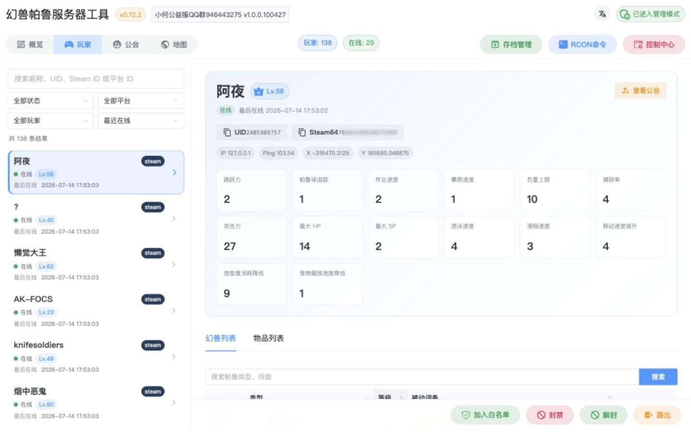
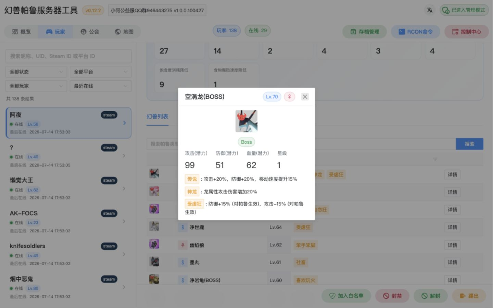
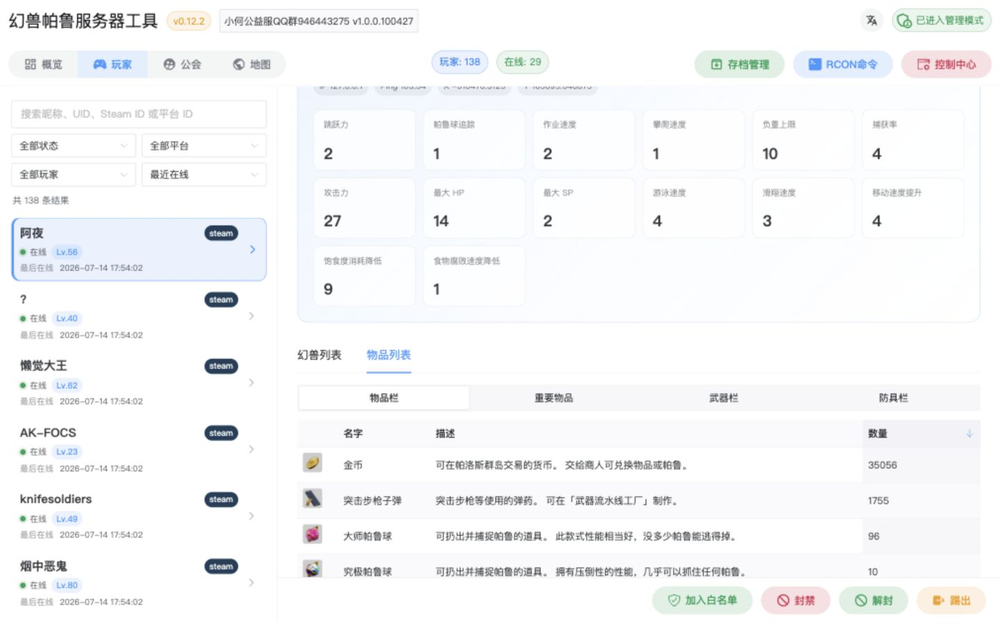
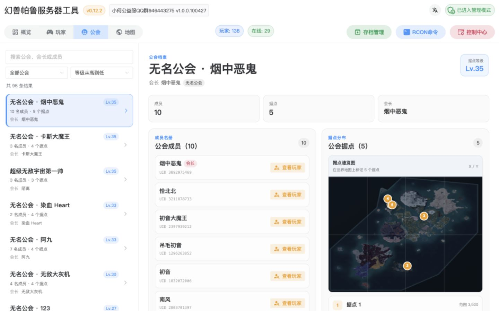
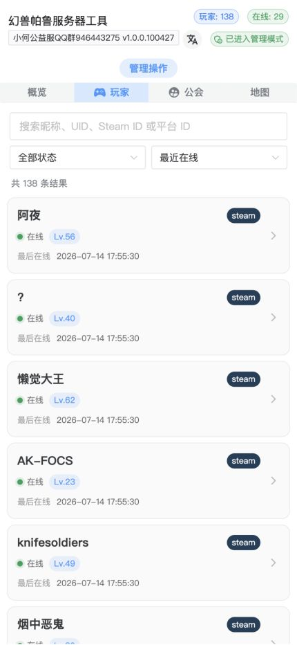
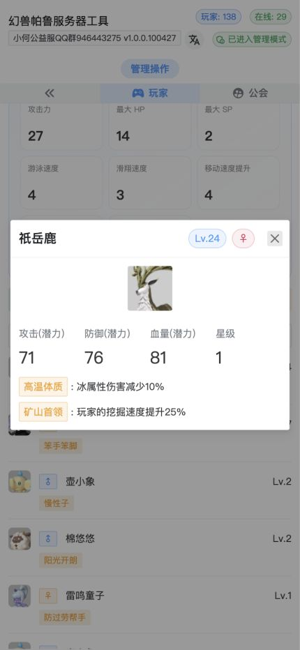
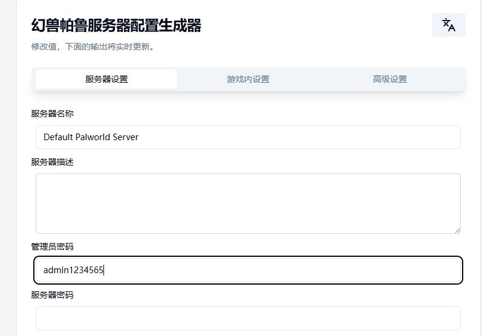
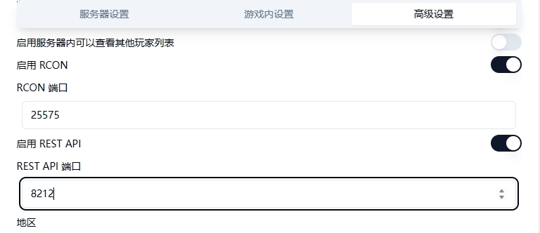

<h1 align='center'>幻兽帕鲁服务器管理工具</h1>

<p align="center">
   <strong>简体中文</strong> | <a href="/docs/README.en.md">English</a> | <a href="/docs/README.ja.md">日本語</a>
</p>

<p align='center'>
  通过可视化界面及 REST 接口管理幻兽帕鲁专用服务器，基于 SAV 存档解析、官方 REST API 与 RCON 实现。
</p>

<p align='center'>
&nbsp;&nbsp;
&nbsp;&nbsp;
&nbsp;&nbsp;

</p>



## 功能

- 玩家、公会、帕鲁和背包数据查看
- 服务器信息、指标和在线玩家列表
- 踢出、封禁、广播和平滑关闭服务器
- 可视化地图与白名单管理
- 自定义及定时 RCON 命令
- 存档定时同步、自动备份与备份管理
- 桌面端和移动端自适应界面
- 管理模式中的可视化 PST 配置

业务数据保存在 `pst.db`，PST 配置和管理员凭据单独保存在 `config.db`。清理或重置配置不会影响玩家、公会、RCON 和备份记录。

> [!NOTE]
> 如果您需要幻兽帕鲁服务器或工具搭建交流，或者需要闭源付费定制功能开发，请加入幻兽帕鲁服务器管理交流群。


## 功能截图

https://github.com/zaigie/palworld-server-tool/assets/17232619/afdf485c-4b34-491d-9c1f-1eb82e8060a1

### 桌面端

|                              |                              |
| :--------------------------: | :--------------------------: |
|  |  |



### 移动端

<p align="center">

</p>

## 开启 REST API 与 RCON

PST 需要游戏服务器开启官方 REST API；自定义 RCON 功能还需要开启 RCON。[RCON 命令参考](./docs/rconCommand_zh.txt)

关闭游戏服务器后，可通过 [Pal-Conf](https://pal-conf.bluefissure.com/) 修改 `PalWorldSettings.ini` 或 `WorldOption.sav`，先设置游戏服务器的管理员密码，再启用 RCON 和 REST API。





## 安装部署

解析 `Level.sav` 会在短时间内使用约 1GB～3GB 内存，请确保运行环境有足够资源。

### 文件部署

1. 从 [GitHub Releases](https://github.com/zaigie/palworld-server-tool/releases) 下载对应系统和架构的压缩包并解压。
2. Linux/macOS 给 `pst` 和 `sav_cli` 增加执行权限并运行 `./pst`；Windows 双击 `start.bat`，或在 PowerShell 中运行 `.\pst.exe`。
3. 浏览器访问 `http://127.0.0.1:8080` 或 `http://{服务器 IP}:8080`，创建管理员并在 Web 弹窗中完成配置。

首次启动使用端口 `8080`。如在 Web 中修改端口、TLS 或其他启动设置，保存后重启 PST。

> [!IMPORTANT]
> PST 不再读取 `config.yaml`、`-config` 参数或 PST 配置环境变量。升级用户请在 Web 配置弹窗中手动复制旧值，确认后删除旧文件和变量。

### Docker 单体部署

先创建需要持久化的数据库文件：

```bash
touch pst.db config.db
```

运行容器，并把游戏存档目录映射到容器内：

```bash
docker run -d --name pst \
  -p 8080:8080 \
  -v /path/to/your/Pal/Saved:/game \
  -v ./backups:/app/backups \
  -v ./pst.db:/app/pst.db \
  -v ./config.db:/app/config.db \
  jokerwho/palworld-server-tool:latest
```

进入 Web 配置后选择“本机目录”，填写或浏览选择容器内的 `/game`。RCON 和 REST API 地址必须是容器能够访问的游戏服务器地址。

`pst.db` 保存业务数据，`config.db` 只保存配置和管理员凭据，两者应分别持久化。需要重置管理员和全部配置时，停止 PST、删除 `config.db` 后重新启动即可。

### Agent 部署

游戏服务器与 PST 不在同一主机时，先在游戏服务器侧启动 `pst-agent`：

```bash
docker run -d --name pst-agent \
  -p 8081:8081 \
  -v /path/to/your/Pal/Saved:/game \
  -e SAVED_DIR="/game" \
  jokerwho/palworld-server-tool-agent:latest
```

再按上面的方式启动 PST，不需要为 PST 容器传入配置环境变量。进入 Web 配置，选择“pst-agent”，填写 `http://游戏服务器IP:8081/sync`，并配置 RCON 与 REST API 地址。

`pst-agent` 自身仍使用命令行参数或 `SAVED_DIR` 指定存档目录，详细操作见 [pst-agent 部署教程](./docs/README.agent.md)。

## 首次进入与配置

1. 访问 PST Web 页面。首次访问必须创建管理模式密码，此操作只允许成功一次。该密码只保护 PST Web 面板，不是游戏服务器的 `AdminPassword`。
2. 首位访问者会成为管理员。如果被他人抢先设置，停止 PST，删除 `config.db` 后重新启动；`pst.db` 不受影响。
3. 创建管理员后会自动打开配置弹窗。选择“本机目录”时，可以直接浏览 PST 所在主机的文件系统；跨主机请选择“pst-agent”并填写同步 URL。
4. 存档和 RCON 配置组会显示“未配置 / 报错 / 正常”状态；RCON 可通过官方只读 `Info` 命令测试连接，不会修改游戏服务器状态。
5. 填写 RCON、REST API、同步、备份和自动化选项并保存。存档来源、RCON、REST、消息、管理选项和管理员密码等立即生效；只有 Web 监听/TLS 与定时任务周期变化需要重启，页面会列出具体项目。
6. 后续从管理模式的“PST 配置”入口修改。管理员密码更换后，旧登录令牌立即失效。

所有配置均写入当前工作目录的 `config.db`。以下旧配置入口已经删除，不提供兼容读取路径：

- `config.yaml`
- `-config` 命令行参数
- `WEB__*`、`RCON__*`、`REST__*`、`SAVE__*`、`TASK__*`、`MANAGE__*` 等 PST 环境变量

> [!TIP]
> `sav_cli` 默认从 PST 可执行文件所在目录自动查找；一般不需要手动填写解析工具路径。

## 开发与接口文档

- [APIFox 在线接口文档](https://q4ly3bfcop.apifox.cn/)
- 本地 Swagger：`http://127.0.0.1:8080/swagger/index.html`

## 感谢

- [palworld-save-tools](https://github.com/cheahjs/palworld-save-tools) 提供存档解析工具实现
- [palworld-server-toolkit](https://github.com/magicbear/palworld-server-toolkit) 提供存档高性能解析部分实现
- [pal-conf](https://github.com/Bluefissure/pal-conf) 提供游戏服务器配置生成器
- [PalEdit](https://github.com/EternalWraith/PalEdit) 提供最初的数据化思路及逻辑
- [gorcon](https://github.com/gorcon/rcon) 提供 RCON 请求/接收基础能力

## 许可证

根据 [Apache 2.0 许可证](LICENSE) 授权，任何转载请在 README 和文件部分标明；任何商用行为请务必告知。
