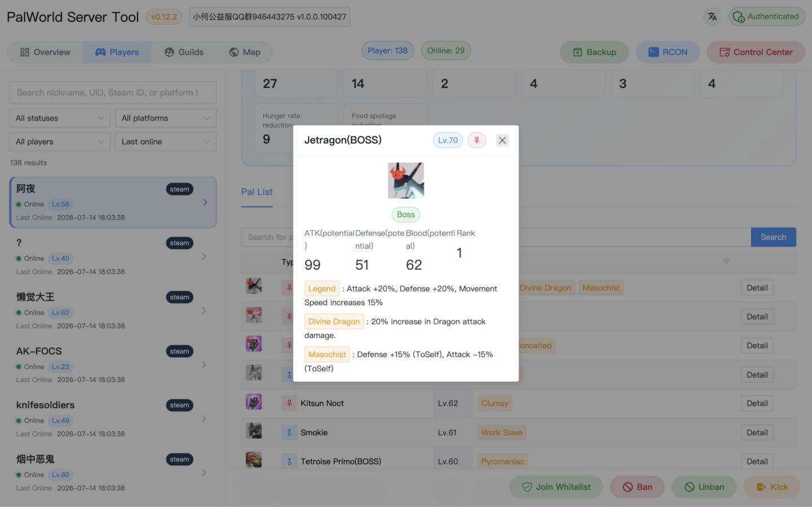
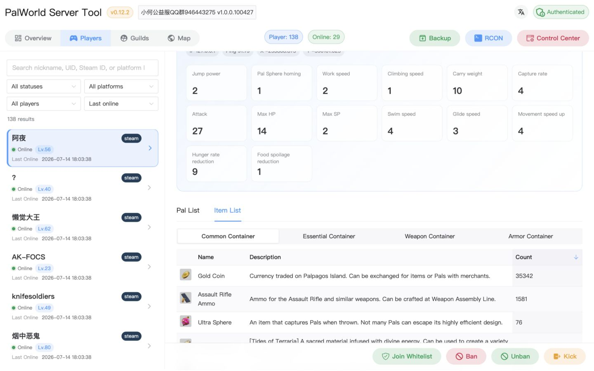
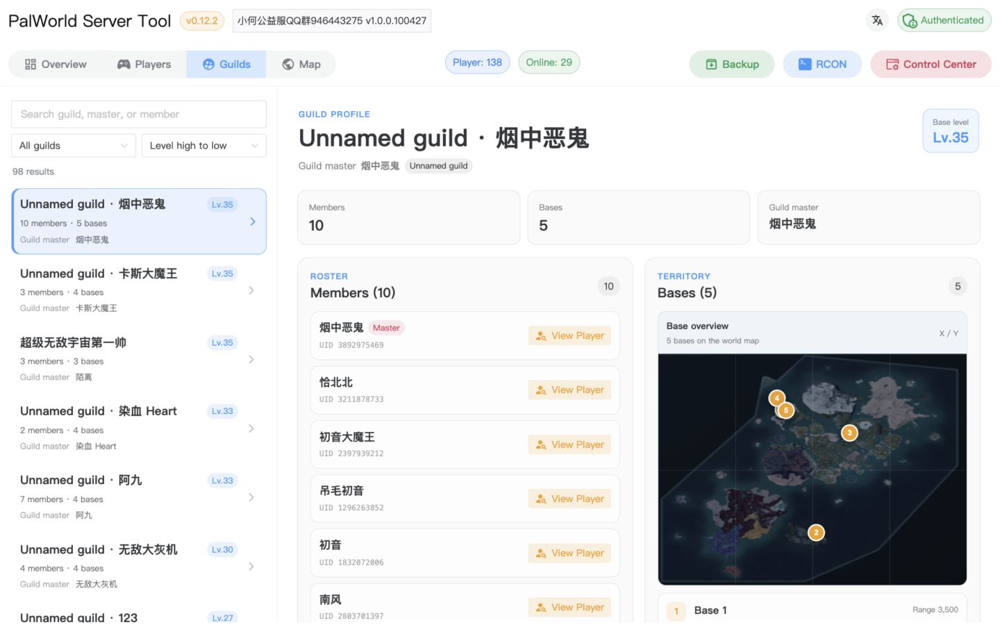
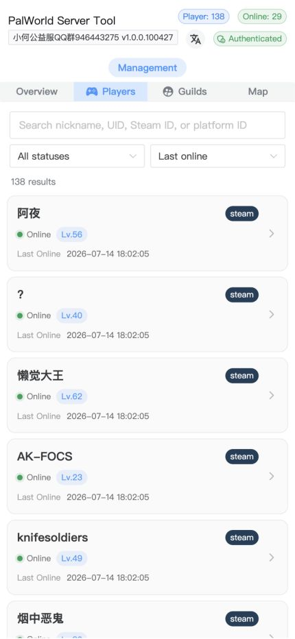
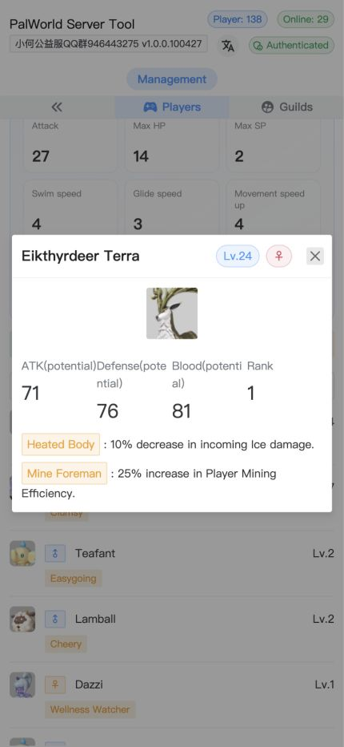
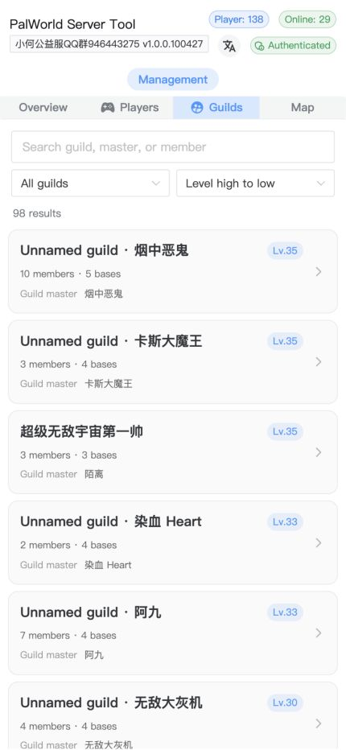

<h1 align='center'>Palworld Server Tool</h1>

<p align="center">
  <a href="/README.md">简体中文</a> | <strong>English</strong> | <a href="/docs/README.ja.md">日本語</a>
</p>

<p align='center'>
  Manage a Palworld dedicated server through a visual interface and REST APIs powered by SAV parsing, the official REST API, and RCON.
</p>

<p align='center'>
&nbsp;&nbsp;
&nbsp;&nbsp;
&nbsp;&nbsp;

</p>


## Features

- View player, guild, Pal, and inventory data
- View server information, metrics, and online players
- Kick and ban players, broadcast messages, and gracefully shut down the server
- Manage the visual map and whitelist
- Save and schedule custom RCON commands
- Schedule save synchronization, automatic backups, and backup management
- Responsive desktop and mobile interfaces
- Configure PST visually in administrator mode

Application data is stored in `pst.db`. PST settings and administrator credentials are stored separately in `config.db`, so resetting settings does not remove player, guild, RCON, or backup records.

> [!NOTE]
> For help with setting up a Palworld server or this tool, or for paid closed-source custom development, join the Palworld server management discussion group.


## Screenshots

https://github.com/zaigie/palworld-server-tool/assets/17232619/afdf485c-4b34-491d-9c1f-1eb82e8060a1

### Desktop

|                           |                           |
| :-----------------------: | :-----------------------: |
|  |  |



### Mobile

<p align="center">

</p>

## Enable the official REST API and RCON

PST requires the Palworld server's official REST API. Custom RCON features also require RCON to be enabled. See the [RCON command reference](./rconCommand_en.txt).

Stop the game server and use [Pal-Conf](https://pal-conf.bluefissure.com/) to configure `PalWorldSettings.ini` or `WorldOption.sav`: set the game server `AdminPassword`, then enable RCON and the REST API.


## Installation

Parsing `Level.sav` briefly uses about 1–3 GB of memory. Make sure the runtime environment has enough resources.

### Release archive

1. Download and extract the archive for your operating system and architecture from [GitHub Releases](https://github.com/zaigie/palworld-server-tool/releases).
2. On Linux/macOS, make `pst` and `sav_cli` executable and run `./pst`. On Windows, run `start.bat` or `.\pst.exe` from PowerShell.
3. Open `http://127.0.0.1:8080` or `http://server-address:8080`, create the PST dashboard administrator, and complete setup in the Web dialog.

The first start listens on port `8080`. After changing the port, TLS, or other startup settings in the Web interface, save the settings and restart PST.

> [!IMPORTANT]
> PST no longer reads `config.yaml`, the `-config` argument, or PST configuration environment variables. Upgrading users must copy old values into the Web settings dialog and then remove the old file and variables.

### All-in-one Docker deployment

Create the persistent database files first:

```bash
touch pst.db config.db
```

Run the container and mount the game save directory inside it:

```bash
docker run -d --name pst \
  -p 8080:8080 \
  -v /path/to/your/Pal/Saved:/game \
  -v ./backups:/app/backups \
  -v ./pst.db:/app/pst.db \
  -v ./config.db:/app/config.db \
  jokerwho/palworld-server-tool:latest
```

In PST Settings, choose “Local directory” and select or browse to `/game` inside the container. RCON and REST API addresses must be reachable from the container.

`pst.db` stores application data, while `config.db` stores only settings and administrator credentials. Persist both separately. To reset the administrator and all settings, stop PST, delete `config.db`, and restart it.

### Agent deployment

If the game server and PST run on different hosts, start `pst-agent` on the game-server host first:

```bash
docker run -d --name pst-agent \
  -p 8081:8081 \
  -v /path/to/your/Pal/Saved:/game \
  -e SAVED_DIR="/game" \
  jokerwho/palworld-server-tool-agent:latest
```

Then start PST as shown above without passing PST configuration environment variables. In PST Settings, choose “pst-agent”, enter `http://game-server-address:8081/sync`, and configure the RCON and REST API addresses.

`pst-agent` itself still uses a command-line argument or `SAVED_DIR` to specify the save directory. See the [pst-agent deployment guide](./README.agent.en.md) for details.

## First visit and settings

1. Open the PST Web interface. The first visitor must create an administrator-mode password, and initialization can succeed only once. This password protects the PST dashboard; it is not the Palworld server `AdminPassword`.
2. The first visitor becomes the administrator. If someone else completes initialization first, stop PST, delete `config.db`, and restart it. `pst.db` is unaffected.
3. The settings dialog opens automatically after the administrator is created. Choose “Local directory” to browse the PST host's filesystem directly, or choose “pst-agent” for a remote host and enter its sync URL.
4. Save-source and RCON groups show Not configured / Error / Normal status. RCON testing uses the official read-only `Info` command and does not change game-server state.
5. Configure and save the RCON, REST API, synchronization, backup, and automation options. Save source, RCON, REST, messaging, management, and administrator-password changes apply immediately. Only Web listener/TLS and scheduled-task interval changes require a restart; the page lists the affected fields.
6. To edit settings later, open “PST Settings” in administrator mode. Changing the administrator password immediately invalidates existing login tokens.

All settings are stored in `config.db` in the current working directory. These legacy configuration paths have been removed and are not read for compatibility:

- `config.yaml`
- the `-config` command-line argument
- `WEB__*`, `RCON__*`, `REST__*`, `SAVE__*`, `TASK__*`, `MANAGE__*`, and other PST environment variables

> [!TIP]
> PST automatically looks for `sav_cli` in the PST executable's directory. You normally do not need to configure its path manually.

## Development and API documentation

- [APIFox API documentation](https://q4ly3bfcop.apifox.cn/)
- Local Swagger: `http://127.0.0.1:8080/swagger/index.html`

## Acknowledgements

- [palworld-save-tools](https://github.com/cheahjs/palworld-save-tools) for the save-parsing implementation
- [palworld-server-toolkit](https://github.com/magicbear/palworld-server-toolkit) for part of the high-performance save parser
- [pal-conf](https://github.com/Bluefissure/pal-conf) for the game-server configuration generator
- [PalEdit](https://github.com/EternalWraith/PalEdit) for the original data and logic concepts
- [gorcon](https://github.com/gorcon/rcon) for the underlying RCON request/response implementation

## License

Licensed under the [Apache License 2.0](../LICENSE). Any redistribution must credit this project in the README and relevant files; please notify the maintainer of any commercial use.
