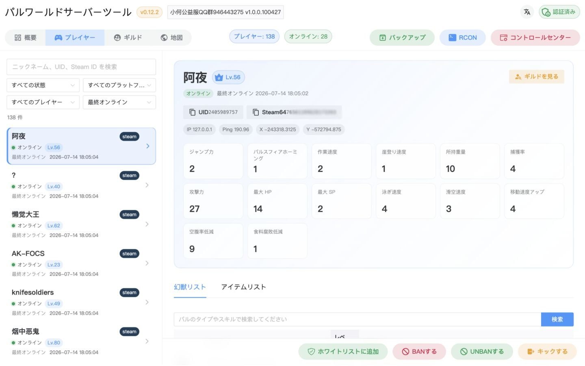
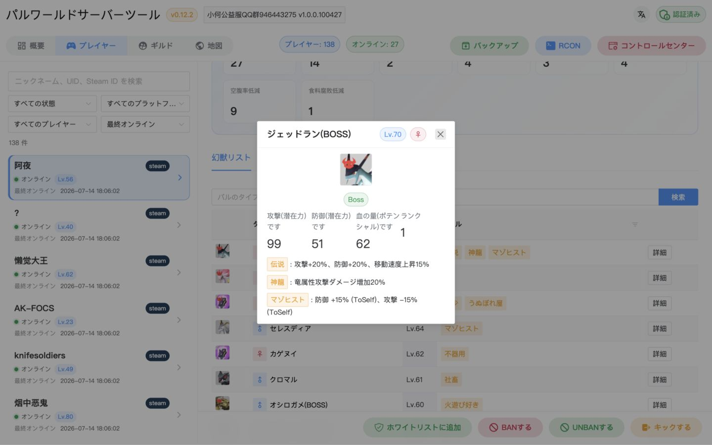
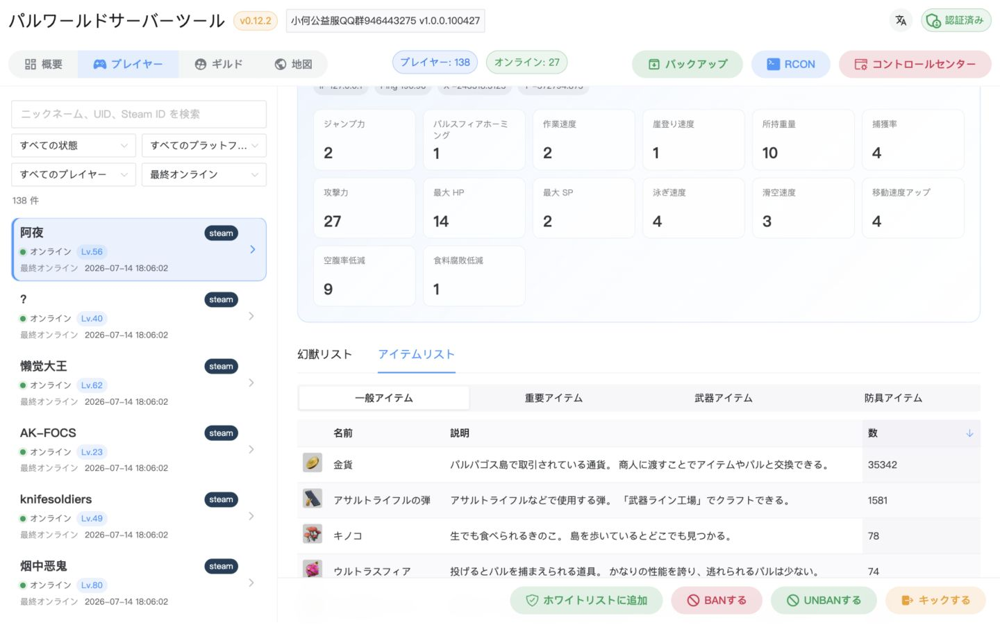
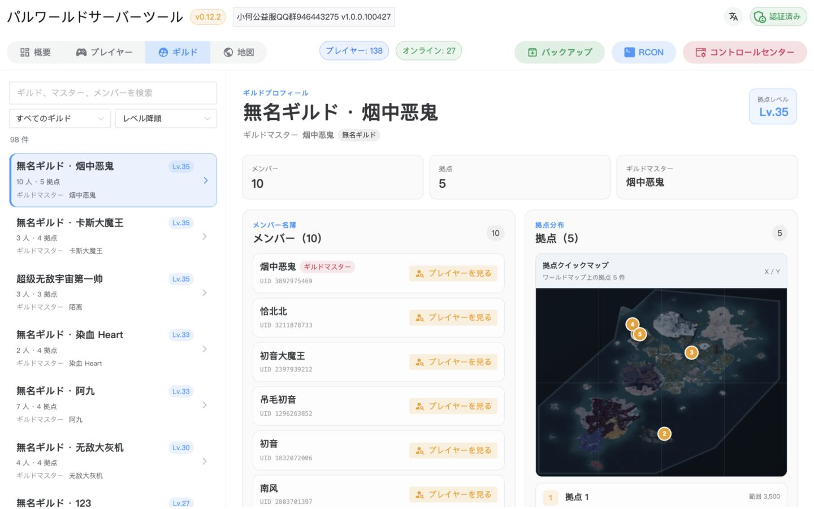
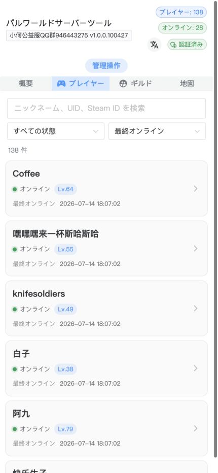
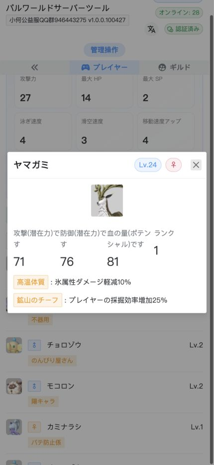
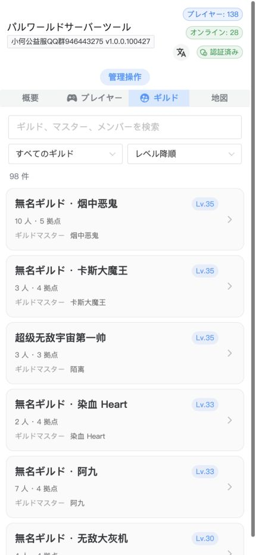
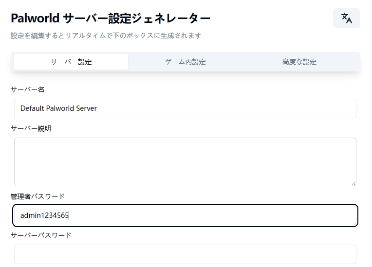
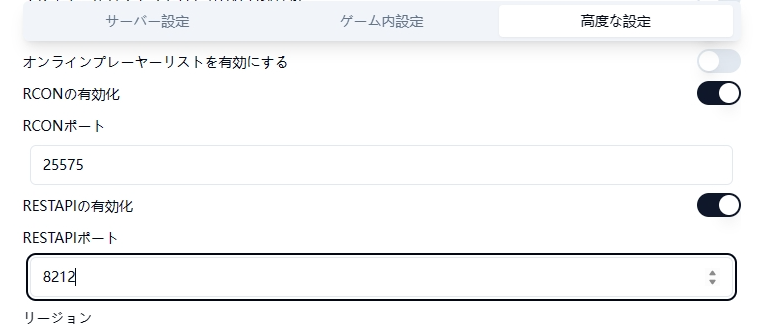

<h1 align='center'>パルワールドサーバーツール</h1>

<p align="center">
  <a href="/README.md">简体中文</a> | <a href="/docs/README.en.md">English</a> | <strong>日本語</strong>
</p>

<p align='center'>
  SAV セーブ解析、公式 REST API、RCON を利用したビジュアル UI と REST API で、Palworld 専用サーバーを管理します。
</p>

<p align='center'>
&nbsp;&nbsp;
&nbsp;&nbsp;
&nbsp;&nbsp;

</p>



## 機能

- プレイヤー、ギルド、パル、インベントリのデータ表示
- サーバー情報、メトリクス、オンラインプレイヤー一覧
- キック、BAN、ブロードキャスト、正常終了
- ビジュアルマップとホワイトリストの管理
- カスタム RCON コマンドと定期実行
- セーブの定期同期、自動バックアップ、バックアップ管理
- PC・モバイル対応 UI
- 管理モード内のビジュアル PST 設定

業務データは `pst.db`、PST 設定と管理者認証情報は別の `config.db` に保存されます。設定をリセットしても、プレイヤー、ギルド、RCON、バックアップ記録には影響しません。

> [!NOTE]
> Palworld サーバーや本ツールの構築について相談したい場合、または有償のクローズドソース機能開発が必要な場合は、Palworld サーバー管理交流グループにご参加ください。


## スクリーンショット

https://github.com/zaigie/palworld-server-tool/assets/17232619/afdf485c-4b34-491d-9c1f-1eb82e8060a1

### デスクトップ

|                           |                           |
| :-----------------------: | :-----------------------: |
|  |  |



### モバイル

<p align="center">

</p>

## 公式 REST API と RCON の有効化

PST には Palworld サーバーの公式 REST API が必要です。カスタム RCON 機能を使う場合は RCON も有効にしてください。[RCON コマンド一覧](./rconCommand_ja.txt)も参照してください。

ゲームサーバーを停止し、[Pal-Conf](https://pal-conf.bluefissure.com/) で `PalWorldSettings.ini` または `WorldOption.sav` を設定します。ゲームサーバーの `AdminPassword` を設定してから RCON と REST API を有効にします。





## インストール

`Level.sav` の解析時には短時間に約 1～3 GB のメモリを使用します。実行環境に十分なリソースがあることを確認してください。

### リリースファイル

1. [GitHub Releases](https://github.com/zaigie/palworld-server-tool/releases) から OS とアーキテクチャに合うファイルをダウンロードして展開します。
2. Linux/macOS では `pst` と `sav_cli` に実行権限を付けて `./pst` を実行します。Windows では `start.bat` または PowerShell から `.\pst.exe` を実行します。
3. `http://127.0.0.1:8080` または `http://サーバーアドレス:8080` を開き、PST Web 管理者を作成して Web ダイアログで設定を完了します。

初回起動はポート `8080` を使用します。Web 画面でポート、TLS、その他の起動設定を変更した場合は、保存後に PST を再起動してください。

> [!IMPORTANT]
> PST は `config.yaml`、`-config` 引数、PST 設定用環境変数を読み込みません。アップグレード時は以前の値を Web 設定へ手動でコピーし、古いファイルと変数を削除してください。

### Docker オールインワン構成

永続化する 2 つのデータベースファイルを先に作成します。

```bash
touch pst.db config.db
```

コンテナを起動し、ゲームのセーブディレクトリをコンテナ内へマウントします。

```bash
docker run -d --name pst \
  -p 8080:8080 \
  -v /path/to/your/Pal/Saved:/game \
  -v ./backups:/app/backups \
  -v ./pst.db:/app/pst.db \
  -v ./config.db:/app/config.db \
  jokerwho/palworld-server-tool:latest
```

PST 設定で「ローカルディレクトリ」を選択し、コンテナ内の `/game` を入力または参照して選択します。RCON と REST API のアドレスはコンテナから到達可能である必要があります。

`pst.db` は業務データ、`config.db` は設定と管理者認証情報だけを保存します。両方を別々に永続化してください。管理者と全設定をリセットするには、PST を停止し、`config.db` を削除して再起動します。

### Agent のデプロイ

ゲームサーバーと PST が別のホストにある場合は、先にゲームサーバー側で `pst-agent` を起動します。

```bash
docker run -d --name pst-agent \
  -p 8081:8081 \
  -v /path/to/your/Pal/Saved:/game \
  -e SAVED_DIR="/game" \
  jokerwho/palworld-server-tool-agent:latest
```

次に上記の方法で PST を起動します。PST 設定用環境変数は渡さないでください。PST 設定で「pst-agent」を選択し、`http://ゲームサーバーアドレス:8081/sync` を入力して、RCON と REST API のアドレスを設定します。

`pst-agent` 自体は引き続きコマンドライン引数または `SAVED_DIR` でセーブディレクトリを指定します。詳しくは [pst-agent デプロイガイド](./README.agent.ja.md)を参照してください。

## 初回アクセスと設定

1. PST Web 画面を開きます。初回アクセス時に管理モードのパスワードを作成する必要があり、初期化に成功できるのは一度だけです。このパスワードは PST Web パネル専用で、ゲームサーバーの `AdminPassword` ではありません。
2. 最初の訪問者が管理者になります。他の人が先に初期化した場合は、PST を停止し、`config.db` を削除して再起動してください。`pst.db` には影響しません。
3. 管理者の作成後、設定ダイアログが自動的に開きます。「ローカルディレクトリ」を選ぶと PST ホストのファイルシステムを直接参照できます。別ホストの場合は「pst-agent」を選び、同期 URL を入力してください。
4. セーブ元と RCON の設定グループには「未設定 / エラー / 正常」の状態が表示されます。RCON テストは公式の読み取り専用 `Info` コマンドを使用し、ゲームサーバーの状態を変更しません。
5. RCON、REST API、同期、バックアップ、自動化の各設定を入力して保存します。セーブ元、RCON、REST、メッセージ、管理オプション、管理者パスワードはすぐに反映されます。Web リスナー/TLS と定期タスクの間隔だけは再起動が必要で、対象項目は画面に表示されます。
6. 以降は管理モードの「PST 設定」から変更できます。管理者パスワードを変更すると、以前のログイントークンは直ちに無効になります。

すべての設定は現在の作業ディレクトリにある `config.db` に保存されます。次の旧設定方法は削除され、互換目的でも読み込まれません。

- `config.yaml`
- `-config` コマンドライン引数
- `WEB__*`、`RCON__*`、`REST__*`、`SAVE__*`、`TASK__*`、`MANAGE__*` などの PST 環境変数

> [!TIP]
> PST は通常、PST 実行ファイルと同じディレクトリから `sav_cli` を自動検出します。解析ツールのパスを手動設定する必要はありません。

## 開発と API ドキュメント

- [APIFox API ドキュメント](https://q4ly3bfcop.apifox.cn/)
- ローカル Swagger：`http://127.0.0.1:8080/swagger/index.html`

## 謝辞

- [palworld-save-tools](https://github.com/cheahjs/palworld-save-tools)：セーブ解析ツールの実装
- [palworld-server-toolkit](https://github.com/magicbear/palworld-server-toolkit)：高性能セーブ解析の一部実装
- [pal-conf](https://github.com/Bluefissure/pal-conf)：ゲームサーバー設定ジェネレーター
- [PalEdit](https://github.com/EternalWraith/PalEdit)：初期のデータ化アイデアとロジック
- [gorcon](https://github.com/gorcon/rcon)：RCON リクエスト／レスポンスの基盤実装

## ライセンス

[Apache License 2.0](../LICENSE) に基づいて提供されます。再配布時は README と関連ファイルに本プロジェクトを明記してください。また、商用利用の際はメンテナーへご連絡ください。
